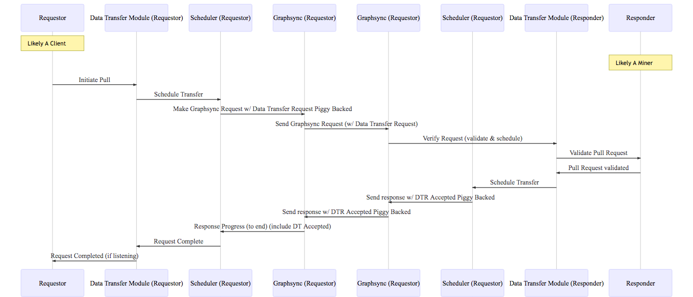

# Go Data Transfer Design Doc

### Goals

1. File Transfer Module should be nuetral to whether it's on a client or a miner
2. File Transfer Module should be nuetral to the larger operations being performed (i.e. storage deal, retrieval deal, etc)
3. File Transfer can be initiated by either the sender or the receiver
4. The negotiation of the file transfer should be indepedent of the underlying transport protocol
5. File transfers can happen for either all or part of a piece

### Concepts

**Push Request** - A request to send data to the other party

**Pull Request** - A request to have the other party send data

**Requestor** - The party that initiates the data transfer request (whether Push or Pull)

**Responder** - The party that receives the data transfer request

**Data Transfer Voucher** - A wrapper around information that can identify and verify the transfer request to the other party

**PullValidator** - When a pull request is received by a responder, looks at the
voucher sent with the request to verify if it's valid. Provided by the responder

**PushValidator** - When a push request is received by a responder, looks at the
data transfer voucher with the request to verify if it's valid. Provided by the
responder

**Scheduler** - Once a request is negotiated and verified, actually schedules and performs the transfer. The scheduler has access to an underlying verifiable protocol

**Listener** - A callback that receives notifications when different data transfer events happen

**Graphsync** - The default transfer protocol used by the Scheduler is Graphsync. The full graphsync specification can be found at [https://github.com/ipld/specs/blob/master/block-layer/graphsync/graphsync.md](https://github.com/ipld/specs/blob/master/block-layer/graphsync/graphsync.md)

### Basic Phases

There are two basic phases to any data transfer:

1. Negotiation - the requestor and responder agree to the transfer by validating with the data transfer voucher
2. Transfer - The transfer is actually initiated by the party that will actually receive data. The default protocol used to do the transfer is Graphsync

### Push Flow


1. A requestor initiates a Push transfer when it wants to send data to another party. 
2. The requestors' data transfer module will send a push request to the responder along with the data transfer voucher. It also puts the data transfer
in the scheduler queue, meaning it expects the responder to initiate a transfer
once the request is verified
3. The responder's data transfer module validates the data transfer request via a PushValidator provided as a dependency by the responder
4. The responder's data transfer module schedules the transfer
5. The responder makes a graphsync request for the data
6. The requestor receives the graphsync request, verifies it's in the scheduler
and begins sending data
7. The responder receives data and can produce an indication of progress
8. The responder completes receiving data, and notifies any listeners

The push flow is ideal for storage deals, where the client initiates the push
once it verifies the the deal is signed and on chain

### Pull Flow



1. A requestor initiates a Pull transfer when it wants to receive data from another party. 
2. The requestors' data transfer module will send a pull request to the responder along with the data transfer voucher. 
3. The responder's data transfer module validates the data transfer request via a PullValidator provided as a dependency by the responder
4. The responder's data transfer module schedules the transfer (meaning it is expecting the requestor to initiate the actual transfer)
5. The responder's data transfer module sends a response to the requestor saying it has accepted the transfer and is waiting for the requestor to initate
the transfer
6. The requestor schedules the data transfer
7. The requestor makes a graphsync request for the data
8. The responder receives the graphsync request, verifies it's in the scheduler
and begins sending data
9. The requestor receives data and can produce an indication of progress
10. The requestor completes receiving data, and notifies any listeners

### Protocol

A data transfer is negotiated over the network via the data transfer protocol

A Pull request expects a response. The requestor does not initiate the transfer
until they know the request is accepted.

A Push request does expect a response. If the Responder accepts the request
they initiate the transfer

#### Format

```protobuf
message DataTransferMessage {
  message Request {
    int32 channelID = 1
    bool isPull = 2
    bytes voucher = 3
    bytes pieceID = 4
    bytes selector = 5
    bool isPartial = 6
    bool isCancel = 7
  }

  message Response {
    int32 channelID = 1
    boolean accepted = 2
  }

  bool isResponse = 1
  Request request = 2
  Response response = 3
}
```

### Prequisite Dependency Work

There are two pieces of pre-work needed to build the data transfer module

1. *go-ipld-prime* - needs to be augmented to read dag-protobuf encoded IPLD nodes (for unixFS files)
2. *go-graphsync* - needs to be augmented to allow validating requests before responses are sent, and to send validation information in a request

### API & Data Structures

```golang
import ipld "github.com/filecoin-project/specs/libraries/ipld"

type Address struct {}
type PieceStore struct {}
type StorageDealID struct {}
type RetrievalDealID struct {}
type Function struct {}
type Piece struct {}
type ChannelID UInt
type LibP2PHost struct {}

type DataTransferSubsystem struct @(mutable) {
	host					libp2p.Host
	dataTransfers {ChannelID: DataTransferChannel}
	pushValidator PushValidator
	pullValidator PullValidator
	pieceStore    PieceStore

  // open a data transfer that will send data to the recipient address and
  // transfer the whole piece
	OpenPushDataTransfer(address Address, voucher DataTransferVoucher, PieceRef CID) ChannelID

  // open a data transfer that will send data to the recipient address and
  // transfer parts of the piece that match the selector
	OpenPartialPushDataTransfer(address Address, voucher DataTransferVoucher, PieceRef CID
	Selector ipld.Selector) ChannelID

  // open a data transfer that will request data from the sending address
  // and transfer the whole piece
	OpenPullDataTransfer(address Address, voucher DataTransferVoucher, PieceRef CID) ChannelID
  
  // open a data transfer that will request data from the sending address and
  // transfer parts of the piece that match the selector
	OpenPartialPullDataTransfer(address Address, voucher DataTransferVoucher, PieceRef CID
  Selector ipld.Selector) ChannelID
  
	// close an open channel (effectively a cancel)
	CloseDataTransferChannel(x ChannelID)         struct{}
	
	// get status of a transfer
	TransferChannelStatus(x ChannelID)            DataTransferStatus
	
	// get notified when certain types of events happen
	RegisterDataTransferListener(listener DataTransferListener)

}

// A DataTransferVoucher is a ticket that is used to validate
// a data transfer request against the underlying storage or retrieval deal
// that precipitated it
type DataTransferVoucher union {
	StorageDealVoucher 
	RetrievalDealVoucher
}

type StorageDealVoucher struct {
	id StorageDealID
}

type RetrievalDealVoucher struct {
	id RetrievalDealID
}

// A PushValidator validates an incoming push request from the network
type PushValidator struct {
	ValidatePush(
		sender Address, 
		voucher DataTransferVoucher, 
		PieceRef CID, 
		Selector ipld.Selector)
}

// A PullValidator validates an incoming pull request from the network
type PullValidator struct {
	ValidatePull(		
		receiver Address, 
		voucher DataTransferVoucher, 
		PieceRef CID, 
		Selector ipld.Selector)
}

// a data transfer listener specifies a callback that happens
// when certain types of events occur
type DataTransferListener struct {
	eventType DataTransferEvent
	Callback(dataTransfer DataTransferChannel, metadata EventMetadata) struct{}
}

type Open struct {}
type Progress struct {}
type Error struct {}
type Complete struct {}

type DataTransferEvent union {
	Open
	Progress
	Error
	Complete
}

type EventMetadata struct {}

type SchedulerCallback func (result ResultCode)

type TransferProgress {
  Id ChannelID
  Progress float // 0...1
}

// A Scheduler manages actually scheduling data transfer requests on the network
// Assumes access to error-checked, ordered, reliable transmission protocol
type Scheduler struct {
  ScheduleTransfer(channelID ChannelID, onComplete SchedulerCallback) struct{}
  InProgressTransfers() [TransferProgress]
}

// Data tracked for a data transfer
// TODO: Needs work
type DataTransferChannel struct {
	channelID     ChannelID
  PieceRef      CID
  Selector      ipld.Selector
	voucher       DataTransferVoucher
	sender        Address
	recipient     Address
	totalSize     UVarint
	sent          UVarint
	received      UVarint

	channelType() DataTransferType  @(cached)
	transferNum() Float             @(cached)
}

type Sender struct {}
type Recipient struct {}

type DataTransferType union {
	Sender
	Recipient
}

type Ongoing struct {}
type Completed struct {}
type Failed struct {}
type ChannelNotFoundError struct {}

type DataTransferStatus union {
	Ongoing
	Completed
	Failed
	ChannelNotFoundError
}
```


