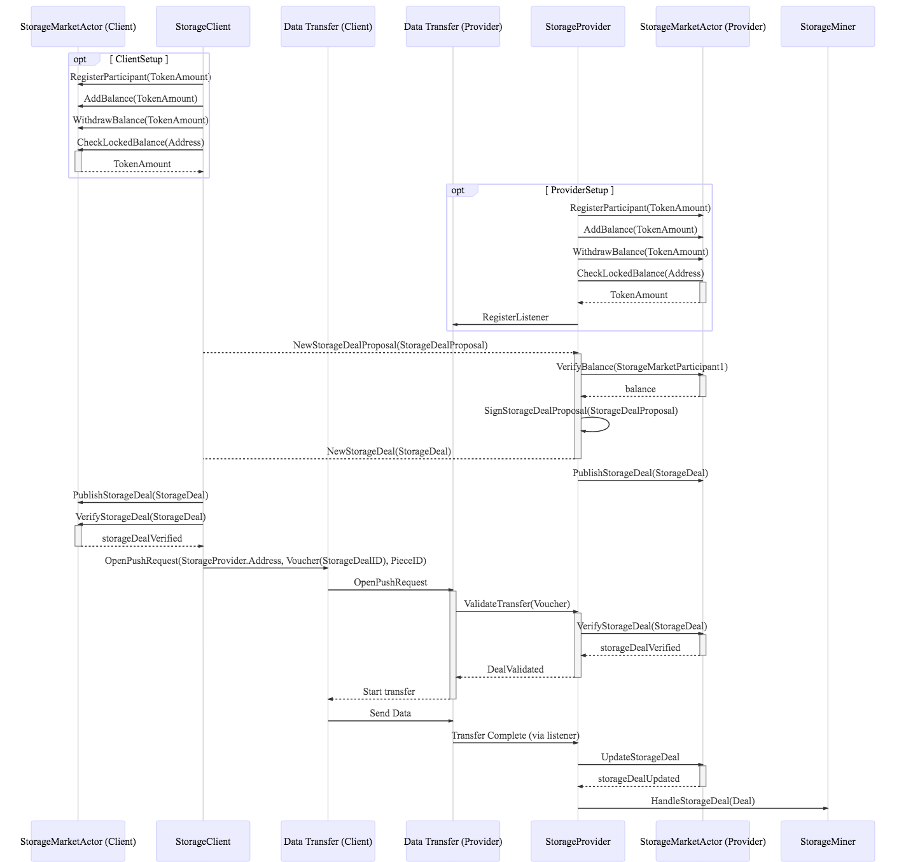
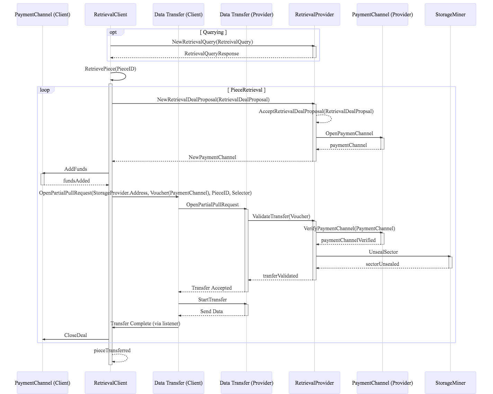

# Auxilary: Markets Shared Component Proposal

### Goals

1. StorageMarket & RetrievalMarket can operate in a seperate process from the chain, storageminer, and data transfer (but don't need to)
2. Retrievals can be done in chunks to allow building trust in miner as data is retrieved. But on the client side they can be tracked as a whole.
3. StorageDeals go on chain. RetrievalDeals operate off chain, only interacting with chain through PaymentChannels
4. All chain components have no responsibility other than updating the chain (the StorageMarketActor does not coordinate next steps in chain)

### Concepts

**StorageClient** - The party requesting storage

**StorageProvider** - The party offering storage

**StorageDealProposal** - A storage deal made and signed by the client, not accepted

**StorageDeal** - A storage deal that has been accepted and signed by the StorageProvider

**StorageMarketActor** - The component that puts storage deals on chain and keeps them updated.

**RetrievalClient** - The party requesting retrieval

**RetrievalProvider** - The party retrieving data and sending to the client

**RetrievalRequest** - a concept local to the RetrievalClient, for a piece, that
may be transferred through one or more RetrievalDeals

**RetrievalDeal** - a deal to transfer some or all of a piece. Not signed, simply a proposal

**PaymentChannel** - the only on chain component of a retrieval deal, and the canonical way to reference a retrieval that has been agreed upon by parties

### TODO

- Asks/Bids

### StorageMarket Flow



1. A storage deal is initiated by the StorageClient sending a StorageDealProposal to the StorageProvider
2. If the StorageProvider accepts the deal, it signs the deal and returns the signed StorageDeal to the StorageClient
3. At this point, either party may place the deal on chain through the StorageMarketActor, though canonically, the StorageProvider should always do this as soon as it signs the deal
4. The StorageClient opens a push request through the data transfer system
5. The StorageProvider receives the data transfer request and verifies it throught he StorageMarketActor
6. The StorageProvider initiates data transfer
7. The StorageClient sends data
8. The StorageProvider is notified transfer is complete
9. The StorageProvider tells the StorageMarketActor to update the deal
10. The StorageProvider tells the StorageMiner to add the piece and begin sealing

### RetrievalMarket Flow



1. The user (cmd line, api, etc) sends a RetrievalRequest to the RetrievalClient
2. For n partial pieces of the piece id:
  a. RetrievalClient sends a RetrievalDeal to the RetrievalProvider for the partial piece
  b. RetrievalProvider accepts the deal and opens a Payment Channel
  c. RetrievalProvider sends the payment channel to RetrievalClient
  d. RetrievalClient adds funds to the PaymentChannel (? - not sure how payment channels work)
  e. RetrievalClient opens a pull request through the data transfer system
  f. The RetrievalProvider receives the data transfer request and verifies it throught the PaymentChannel
  g. The RetrievalProvider notifes the RetrievalClient that it accepts the data transfer
  h. The RetrievalClient initiates data transfer
  i. The RetrievalProvider sends data
  j. The RetrievalClient is notified transfer is complete
  k. The RetrievalClient tells the PaymentChannel to transfer funds
3. The RetrievalClient notifies the user transfer is complete

### Protocol

TODO

#### StorageDealProtocol
#### RetrievalDealProtocol

Should these be seperate?

### Data Structures

```golang
type StorageClient struct {
  dataTransfer DataTransferSubsystem
  storageMarketActor StorageMarketActor
  host LibP2PHost

  // starts a storage deal
  InitiateDeal(StorageDealParams) ClientDealRef
  
  // internal method called when a signed proposal
  // is received
  onStorageDealReceived(StorageDeal)

  // registered with data transfer subsystem as a listener
  // to notify any higher level listeners
  onTransferComplete(DataTransferChannel)

  // query the current storage deal status
  GetStorageDealStatus(ClientDealRef) DealStatus

  // to tell use when evens happen with a deal
  RegisterListener(Listener)
}

type StorageProvider struct {
  dataTransfer DataTransferSubsystem
  storageMarketActor StorageMarkeyActor
  storageMiner StorageMiner
  host LibP2PHost
  
  // internal method called when proposals are received
  onStorageDealProposalReceived(StorageDealProposal)

  // registered with data transfer subsystem as a listener
  onTransferComplete(DataTransferChannel)

  // StorageProvider is a PushValidator for the Data Transfer Subsystem
  VerifyPushRequest(Voucher)
}

type RetrievalDeal struct {
  pieceID CID
  part ipld.Selector
  paymentChannel PaymentChannel
  client address.Address
  provider address.Address
}

type RetrievalRequestData struct {
  pieceID CID
  miner address.Address
  deals [RetrievalDeal] // ? - all the deals for this retrieval...
}

type RetrievalClient struct {
  retrievals map[ClientRef]RetrievalRequestData
  dataTransfer DataTransferSubsystem
  paymentChannelActor PaymentChannelActor
  host LibP2PHost

  // starts a retrieval
  InitiateRetrieval(RetrievalRequest) ClientRef
  
  // internal method called when accepted deal received
  // from provider
  onRetrievalDealReceived(PaymentChannel)

  // registered with data transfer subsystem as a listener
  // to notify any higher level listeners
  onTransferComplete(DataTransferChannel)

  // query the current retrieval status
  GetRetrievalStatus(ClientRef) RetrievalStatus

  // to tell use when events happen with a retrieval
  // including when the whole piece is complete
  RegisterListener(Listener)
}

type RetrievalProvider struct {
  dataTransfer DataTransferSubsystem
  storageMarketActor StorageMarkeyActor
  storageMiner StorageMiner
  host LibP2PHost
  
  // internal method called when proposals are received
  onRetrievalDealReceived(RetrievalDeal)

  // registered with data transfer subsystem as a listener
  onTransferComplete(DataTransferChannel)

  // RetrievalProvider is a PullValidator for the Data Transfer Subsystem
  VerifyPullRequest(Voucher)
}

type StorageMarketActor struct {
  // need access to:
  // - BlockchainSubsystem
  //   - needs access to StateTree
  //     to verify storage capacity and pledge amount
  //     and slash storage providers for storage faults
  //    - needs access to access to MessagePool if deals on chain
  // - NetworkSubsystem
  //   - needs access to MessagePubsub

  ParticipantBalances { Address : StorageParticipantBalance }
  StorageDeals { StorageDealID : StorageDeal }

  RegisterParticipant(lockedBalance TokenAmount) bool
  WithdrawBalance(balance TokenAmount) struct {}
  AddBalance(balance TokenAmount) struct {}
  CheckLockedBalance(participantAddr Address) TokenAmount

  // TODO: There should be some punishment for publishing a deal too late
  // call by CommitSector in StorageMiningSubsystem
  // a StorageDeal is only published on chain when it passes VerifyStorageDeal
  PublishStorageDeal(newStorageDeal StorageDeal) PublishStorageDealResponse

  // check if StorageDeal is still valid
  // check if StorageDeal has the right signature
  // check if provider and client have sufficient balances
  VerifyStorageDeal(newStorageDeal StorageDeal) bool

  // TODO: StorageDeals should be renewable
  UpdateStorageDeal(newStorageDeal StorageDeal) struct {}

  // call by StorageMarketActor on ExpiredSet
  // remove StorageDeal from StorageMarketActor
  // return StorageCollateral to miners
  CloseExpiredStorageDeal(targetStorageDeal StorageDeal) struct {}

  // call by StorageMinerActor on successful PoSt Submission
  HandleStorageDealPayment(storageDeal StorageDeal, currEpoch Epoch) struct {}

  // call by StorageMinerActor or CronActor to slash deal collateral
  SlashStorageDealCollateral(targetStorageDeal StorageDeal) struct {}

}
```