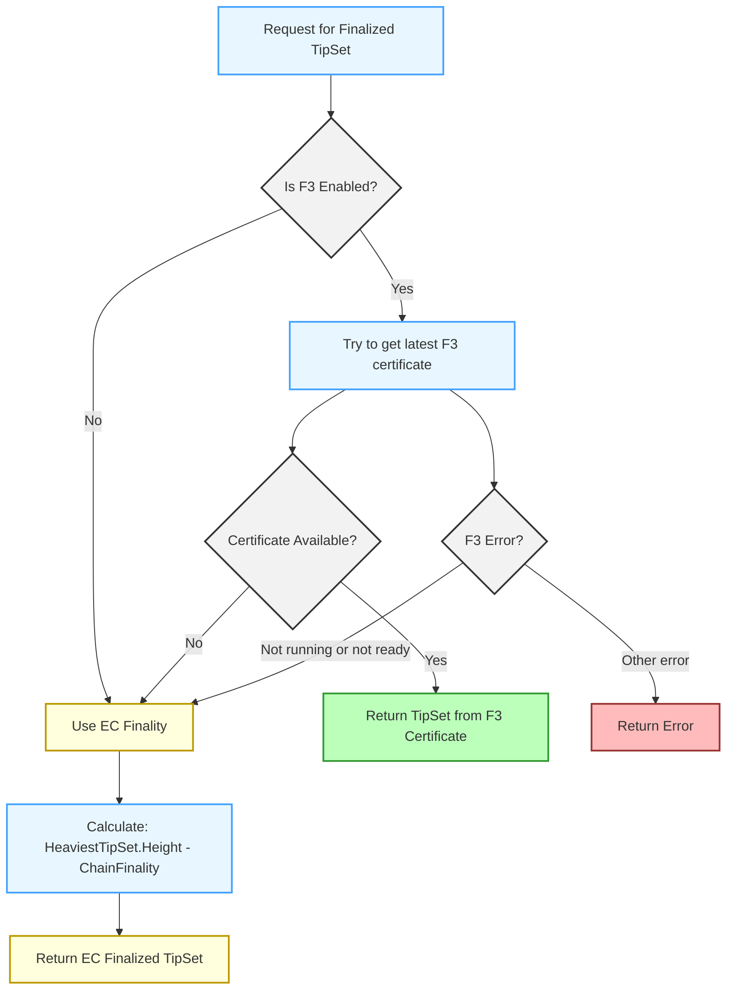

# Filecoin V2 APIs

# Status

- 2025-04-09: This document is still actively a Work In Progress.  It has a draft discussing [ChainGetTipSet](https://www.notion.so/ChainGetTipSet-1d0dc41950c181cba489f82d6879357d?pvs=21).  Additional APIs and API Groups will be added as part of working on https://github.com/filecoin-project/lotus/issues/12987.

# Introduction

The Filecoin V2 APIs represent a significant redesign of Filecoin’s RPC interface with several important goals in mind:

1. **User-Friendly Interface**: The APIs provide intuitive ways to interact with the Filecoin network without requiring deep technical knowledge of its internals.
2. **Expressive Selection Mechanisms**: Through the Selector pattern, users can clearly express what data they want using criteria that make sense for their use case.
3. **Smaller API Footprint**: By using flexible selectors, we’ve reduced the number of distinct API methods needed, consolidating functionality into fewer, more powerful endpoints.
4. **F3 Awareness**: The APIs are fully aware of Filecoin Fast Finality (F3) and can automatically adapt to provide the appropriate finality guarantees based on the node’s consensus protocol.
5. **Future Extensibility**: The design allows for extending selection criteria without breaking existing functionality or requiring new API methods.

# The Selector Pattern

At the core of the V2 APIs design is the concept of “Selectors” - flexible constructs that let you specify exactly what blockchain data you want. Rather than having different methods for different selection criteria, a single method accepts various selector types to retrieve data in different ways.

This documentation focuses on the `TipSetSelector` as implemented in the `ChainGetTipSet` method, which is just one part of the Chain API group in the larger V2 APIs initiative. Additional API groups are under development, including:

- **State API Group**: Will provide enhanced state query capabilities with similar selector patterns
- **Mpool API Group**: Will offer improved message pool interaction
- **Wallet API Group**: Will introduce more powerful wallet operations

Each API group follows the same design principles of extensibility, expressiveness, and F3 awareness while minimising the API surface area.

The remainder of this documentation explores the `TipSetSelector` in detail, showing how to use it with the `ChainGetTipSet` method through various examples and use cases.

# Overview

This documentation covers the TipSet selection mechanisms in the Filecoin V2 APIs, focusing on the flexible selection patterns introduced for retrieving tipsets from the Filecoin blockchain.

## Groups

- Chain
    - `ChainGetTipSet`
- State
    - `StateGetActor`
    - `StateGetID`

# Chain

The Chain method group contains methods for interacting with the blockchain, allowing you to query various aspects of the Filecoin blockchain.

## ChainGetTipSet

```
Filecoin.ChainGetTipSet
```

**Description**: Retrieves a tipset that corresponds to the specified selector criteria.

**Permissions**: read

### Selector Types

The API introduces a flexible way to select tipsets using different criteria:

1. **By Tag** - Using predefined references like `latest` or “`finalized`”
2. **By Height** - Selecting a tipset at a specific blockchain height
3. **By Key** - Directly specifying a tipset by its cryptographic key

### 1. By Tag

```json
{
  "tag": "latest"
}
```

or

```json
{
  "tag": "finalized"
}
```

**JSON-RPC Request Example:**

```json
{
  "jsonrpc": "2.0",
  "method": "Filecoin.ChainGetTipSet",
  "params": [
    {
      "tag": "latest"
    }
  ],
  "id": 1
}
```

Where:
- `"latest"` - Returns the most recent tipset in the chain with the heaviest weight
- `"finalized"` - Returns the most recent tipset considered final by the node based on the consensus protocol

### 2. By Height

```json
{
  "height": {
    "at": 123456,
    "previous": true,
    "anchor": {
      "tag": "finalized"
    }
  }
}
```

**JSON-RPC Request Example:**

```json
{
  "jsonrpc": "2.0",
  "method": "Filecoin.ChainGetTipSet",
  "params": [
    {
      "height": {
        "at": 123456,
        "previous": true,
        "anchor": {
          "tag": "finalized"
        }
      }
    }
  ],
  "id": 1
}
```

Where:
- `at` - The chain epoch to retrieve
- `previous` (optional) - If true and the tipset at the specified height is null, returns the previous non-null tipset. Otherwise, it returns the tipset as is at specified height, which may be `null`. By default the `previous` is set to `false`.
- `anchor` (optional) - Specifies a reference point; the selected tipset is guaranteed to be a child of this anchor at the given height. Defaults to `finalized` tipset if unspecified.

### 3. By Key

```json
{
  "key": [{
    "/": "bafy2bzacecmargpnize7vt4vfj7ownecbkue6q23eucrn3kvg4rdd54ym77cy"
  }]
}
```

**JSON-RPC Request Example:**

```json
{
  "jsonrpc": "2.0",
  "method": "Filecoin.ChainGetTipSet",
  "params": [
    {
      "key": [{
        "/": "bafy2bzacecmargpnize7vt4vfj7ownecbkue6q23eucrn3kvg4rdd54ym77cy"
      }]
    }
  ],
  "id": 1
}
```

### Response

The method returns a TipSet object.

**JSON-RPC Response Example:**

```json
{
  "jsonrpc": "2.0",
  "result": {
    "Cids": [
      {
        "/": "bafy2bzacecn2av5bgezy7kid2n26hv5rpccxlajvbfk3cilkgswhagdpnt7eq"
      },
      {
        "/": "bafy2bzaceaqoc5zakbapciic6vkd3p7qgu74252lg642uivcofz4kowbj2s3a"
      }
    ],
    "Blocks": [
      {
        "Miner": "f01234",
        "Height": 123456,
        "Timestamp": 1640995200
        // Additional block data omitted for brevity
      },
      {
        "Miner": "f02468",
        "Height": 123456,
        "Timestamp": 1640995215
        // Additional block data omitted for brevity
      }
    ],
    "Height": 123456
  },
  "id": 1
}
```

### Error Handling

The API will return an error in the following cases:

- No selector is provided (selector must be explicitly specified)
- Multiple selection criteria are specified (only one should be provided)
- Invalid height values (must be non-negative)
- Other validation errors with the selector specification

## Predefined Selectors in the Go SDK

The Go SDK provides convenient predefined constants and factory functions to create selectors easily, without needing to construct the selector structures manually:

```go

// Get latest tipset
latestTipSet, err := node.ChainGetTipSet(context.Background(), types.TipSetSelectors.Latest)

// Get finalized tipset
finalizedTipSet, err := node.ChainGetTipSet(context.Background(), types.TipSetSelectors.Finalized)

// Get tipset at specific height
heightSelector := types.TipSetSelectors.Height(123456, true, types.TipSetAnchors.Finalized)
heightTipSet, err := node.ChainGetTipSet(context.Background(), heightSelector)

// Get tipset by key
keySelector := types.TipSetSelectors.Key(someTipSetKey)
keyTipSet, err := node.ChainGetTipSet(context.Background(), keySelector)

```

These predefined selectors and factory functions handle all the internal complexity of creating properly structured selectors, making your code cleaner and less error-prone.

# State

The State method group contains methods for interacting with the Filecoin blockchain state, including actor information, addresses, and chain data. These methods allow querying the blockchain state at any point in its history using the same flexible TipSet selection mechanisms used in the Chain API group.

## StateGetActor

```
Filecoin.StateGetActor
```

**Description**: Retrieves the actor information for the specified address at the selected tipset.

**Permissions**: read

### Parameters

1. `address` - The Filecoin address to look up
2. `tipsetSelector` - A selector specifying which tipset to query the state from

### Request Example

```json
json
[ ]

{
  "jsonrpc": "2.0",
  "method": "Filecoin.StateGetActor",
  "params": [
    "f01234",
    {
      "tag": "finalized"
    }
  ],
  "id": 1
}

```

This example retrieves the actor information for address `f01234` at the finalized tipset.

### Response

The method returns an Actor object containing:

- Code CID (determines the actor's type)
- State root CID
- Balance in attoFIL
- Nonce (for account actors)

**JSON-RPC Response Example:**

```json
json
[ ]

{
  "jsonrpc": "2.0",
  "result": {
    "Code": {
      "/": "bafk2bzacebp3lhba2jem4ze27hvzkao3r5z5zpeiq4qmx6b3waqoqpqzpoky2"
    },
    "Head": {
      "/": "bafy2bzaceahypovebb3jbnp2zhrtwgetb7afsbefp2yrsedcnmv4bwhzotkwy"
    },
    "Nonce": 42,
    "Balance": "1000000000000000000"
  },
  "id": 1
}

```

If the actor does not exist at the specified tipset, an error is returned.

## StateGetID

```
Filecoin.StateGetID
```

**Description**: Retrieves the ID address for the specified address at the selected tipset.

**Permissions**: read

### Parameters

1. `address` - The Filecoin address to resolve to an ID address
2. `tipsetSelector` - A selector specifying which tipset to query the state from

### Request Example

```json
json
[ ]

{
  "jsonrpc": "2.0",
  "method": "Filecoin.StateGetID",
  "params": [
    "f2kc5mnx4pvgdpm5lzgutbfuzcnmkedlgd5wvyky",
    {
      "tag": "latest"
    }
  ],
  "id": 1
}

```

This example resolves the given robust address to its ID address at the latest tipset.

### Response

The method returns the ID address for the given address.

**JSON-RPC Response Example:**

```json
json
[ ]

{
  "jsonrpc": "2.0",
  "result": "f01234",
  "id": 1
}

```

If the address cannot be resolved at the specified tipset, an error is returned.

# Consensus Protocol Notes

The Filecoin network is currently in the process of testing and activating Filecoin Fast Finality (F3), a new consensus mechanism that provides faster finality guarantees. During this transition period, the network will contain a mix of nodes - some with F3 enabled and others still using only the traditional Expected Consensus (EC) finality mechanism.

This heterogeneous environment creates potential challenges for applications that need consistent finality information. The V2 APIs address this by implementing graceful fallback mechanisms that ensure a smooth API experience regardless of a node's configuration. While EC finality will always be available as a reliable fallback, the APIs are designed to automatically use F3 when available, handling edge cases transparently for the application developer.
This approach ensures that applications can be built today that will seamlessly benefit from improved finality as F3 adoption increases across the network, without requiring code changes or special handling of different node types.

## Understanding `finalized` TipSets

The `finalized` tag is a powerful concept in the V2 APIs that returns the tipset considered finalised by the node's consensus protocol. This enables applications to work with confirmed blockchain data without needing to understand the underlying finality mechanism.

### Node Configuration Impact

How the `finalized` tag behaves depends on the node's configuration:

1. **When F3 is Enabled and Ready**:
    - The API returns the tipset identified by the latest F3 certificate
    - This provides faster finality guarantees (typically within minutes)
    - The finalised tipset comes directly from the consensus certificates
2. **When F3 is Disabled or Not Ready**:
    - The API automatically falls back to EC finality
    - EC finality is based on chain depth  (900 epochs, or 7.5 hours)
    - The finalised tipset is calculated as: `heaviestTipSet.Height - policy.ChainFinality`

### Graceful Fallback Mechanism

The implementation includes several fallback scenarios to ensure robust operation:



This graceful fallback ensures that the `finalized` tag always returns a meaningful result regardless of the node's configuration or the state of the F3 subsystem.

**Example: Retrieving `finalized` TipSet**

```json
{
  "jsonrpc": "2.0",
  "method": "Filecoin.ChainGetTipSet",
  "params": [
    {
      "tag": "finalized"
    }
  ],
  "id": 1
}

```

With this request:

- If F3 is enabled and ready: you'll get the F3-finalised tipset (minutes old)
- If F3 is disabled or not ready: you'll get the EC-finalised tipset (hours old)

### Anchors and Default Behaviour

When using height-based selectors with no explicit anchor, the API defaults to using the `finalized` tag as the anchor:

```json
{
  "jsonrpc": "2.0",
  "method": "Filecoin.ChainGetTipSet",
  "params": [
    {
      "height": {
        "at": 123456,
        "previous": true
// No anchor specified - defaults to "finalized"
      }
    }
  ],
  "id": 1
}

```

This behaviour ensures that by default, height-based queries follow the finalised chain, which provides the strongest consistency guarantees for applications.

### Benefits for Application Development

The `finalized` tag provides several advantages:

1. **Abstraction from Finality Mechanisms**: Applications don't need to know whether a node uses F3 or EC finality
2. **Consistent Behaviour**: API behaves predictably regardless of underlying network configuration
3. **Future-Proof**: As Filecoin evolves with new consensus algorithms, the `finalized` concept remains stable
4. **Performance Options**: Applications can choose between faster queries with `latest` or more confirmed data with `finalized`

# Appendix

## JSON-RPC Examples

### 1. Get Latest TipSet

**Request:**

```json
{
  "jsonrpc": "2.0",
  "method": "Filecoin.ChainGetTipSet",
  "params": [
    {
      "tag": "latest"
    }
  ],
  "id": 1
}
```

### 2. Get Finalized TipSet

**Request:**

```json
{
  "jsonrpc": "2.0",
  "method": "Filecoin.ChainGetTipSet",
  "params": [
    {
      "tag": "finalized"
    }
  ],
  "id": 1
}
```

### 3. Get TipSet at Specific Height

**Request:**

```json
{
  "jsonrpc": "2.0",
  "method": "Filecoin.ChainGetTipSet",
  "params": [
    {
      "height": {
        "at": 123456,
        "previous": true,
        "anchor": {
          "tag": "finalized"
        }
      }
    }
  ],
  "id": 3
}
```

### 4. Get TipSet by Key

**Request:**

```json
{
  "jsonrpc": "2.0",
  "method": "Filecoin.ChainGetTipSet",
  "params": [
    {
      "key": [{
        "/": "bafy2bzacecmargpnize7vt4vfj7ownecbkue6q23eucrn3kvg4rdd54ym77cy"
      }]
    }
  ],
  "id": 4
}
```

### 5. Error Response Example (Invalid Selector)

**Request:**

```json
{
  "jsonrpc": "2.0",
  "method": "Filecoin.ChainGetTipSet",
  "params": [
    {
      "height": {
        "at": -100,
        "previous": true
      }
    }
  ],
  "id": 5
}
```

**Response:**

```json
{
  "jsonrpc": "2.0",
  "error": {
    "code": -32602,
    "message": "invalid tipset height: epoch cannot be less than zero"
  },
  "id": 5
}
```

## Advanced Usage Examples

### Working with TipSet Anchors and Dealing with Null Epochs

When retrieving TipSets from the Filecoin blockchain, there are two powerful options to ensure you get the data you need: anchors and the previous flag.

Anchors allow you to specify which chain branch to follow when retrieving a TipSet at a particular height. This is essential in blockchain systems where forks can occur, ensuring your query returns a TipSet from the correct chain branch.

Compared to V1 APIs, anchors reduce the number of API calls required to get TipSets from the correct chain. You can specify either a tag (`latest` or `finalized`) or a specific TipSet key as your anchor.

The `previous` flag addresses another common challenge: handling null TipSets. In the Filecoin blockchain, not every height has a TipSet (some heights might be "null" rounds with no blocks).

When you set `previous: true`:

- If a TipSet exists at exactly the requested height, it is returned.
    - This is the case regardless of whether `previous` is true or false.
- If no TipSet exists at the requested height, the API automatically finds and returns the most recent non-null TipSet at a height less than the requested height

This behaviour eliminates the need for additional queries to handle null rounds, making the interaction more streamlined.

### JSON-RPC Examples Combining Anchors and Previous Flag

### Example 1: Get a tipset at a specific height, with previous fallback, anchored to finalised chain

```json
{
  "jsonrpc": "2.0",
  "method": "Filecoin.ChainGetTipSet",
  "params": [
    {
      "height": {
        "at": 123456,
        "previous": true,
        "anchor": {
          "tag": "finalized"
        }
      }
    }
  ],
  "id": 1
}

```

This request says: "Give me the TipSet at height 123456 on the finalised chain. If there's no TipSet at exactly that height, give me the most recent non-null TipSet before it."

### Example 2: Get exactly the tipset at a specific height (no fallback), anchored to latest chain

```json
{
  "jsonrpc": "2.0",
  "method": "Filecoin.ChainGetTipSet",
  "params": [
    {
      "height": {
        "at": 123456,
        "previous": false,
        "anchor": {
          "tag": "latest"
        }
      }
    }
  ],
  "id": 1
}

```

This request says: "Give me the TipSet at exactly height 123456 on the latest (heaviest) chain. If that height is null, return a null TipSet."

### Example 3: Get a tipset with previous fallback, anchored to a specific TipSet key

```json
{
  "jsonrpc": "2.0",
  "method": "Filecoin.ChainGetTipSet",
  "params": [
    {
      "height": {
        "at": 123456,
        "previous": true,
        "anchor": {
          "key": [{
            "/": "bafy2bzacecmargpnize7vt4vfj7ownecbkue6q23eucrn3kvg4rdd54ym77cy"
          }]
        }
      }
    }
  ],
  "id": 1
}

```

This request says: "Give me the TipSet at height 123456 on the chain that contains the TipSet with the specified key. If there's no TipSet at exactly that height, give me the most recent non-null TipSet before it."

### Common Use Cases

1. **Walking Backwards Through a Chain**

To efficiently walk backward through a chain, even through null rounds:

```json
{
  "jsonrpc": "2.0",
  "method": "Filecoin.ChainGetTipSet",
  "params": [
    {
      "height": {
        "at": 100000,
        "previous": true,
        "anchor": {
          "key": [{
            "/": "bafy2bzacecmargpnize7vt4vfj7ownecbkue6q23eucrn3kvg4rdd54ym77cy"
          }]
        }
      }
    }
  ],
  "id": 1
}

```

1. **Handling Network Instability Periods**

During periods of network instability, there might be consecutive null rounds. To robustly get the most recent TipSet before a problematic period:

```json
{
  "jsonrpc": "2.0",
  "method": "Filecoin.ChainGetTipSet",
  "params": [
    {
      "height": {
        "at": 200000,
        "previous": true,
        "anchor": {
          "tag": "finalized"
        }
      }
    }
  ],
  "id": 1
}

```

1. **Checking for Reorganisation with Exact Height Comparison**

If you need to detect chain reorganisations at a specific exact height (not falling back to previous):

```json
{
  "jsonrpc": "2.0",
  "method": "Filecoin.ChainGetTipSet",
  "params": [
    {
      "height": {
        "at": 123456,
        "previous": false,
        "anchor": {
          "tag": "latest"
        }
      }
    }
  ],
  "id": 1
}

```

Then later check again to see if the TipSet at that exact height has changed.

## Go SDK Example Usage

The Filecoin V2 APIs provide a well-structured Go SDK that makes it easy to interact with the TipSet selectors.

### Predefined Selectors in the Go SDK

The Go SDK provides convenient predefined constants and factory functions to create selectors easily, without needing to construct the selector structures manually:

```go
// Using predefined tag selectors
latest := types.TipSetSelectors.Latest      // Get the latest tipset
finalized := types.TipSetSelectors.Finalized // Get the finalized tipset

// Creating height-based selectors with the factory function
heightSelector := types.TipSetSelectors.Height(123, true, nil)  // Height 123, with previous fallback
anchoredHeight := types.TipSetSelectors.Height(123, true, types.TipSetAnchors.Finalized)  // Anchored to finalized tipset

// Creating key-based selectors with the factory function
keySelector := types.TipSetSelectors.Key(someTipSetKey)  // Select by specific TipSetKey

// Anchor constants for height-based selectors
latestAnchor := types.TipSetAnchors.Latest     // Anchor to latest tipset
finalizedAnchor := types.TipSetAnchors.Finalized // Anchor to finalized tipset
keyAnchor := types.TipSetAnchors.Key(someTipSetKey) // Anchor to specific key
```

These predefined selectors and factory functions handle all the internal complexity of creating properly structured selectors, making your code cleaner and less error-prone.

## Consistency Across Selector Usage

### Avoiding Inconsistent State Views

When working with blockchain data, particularly for financial operations or balance tracking, it's crucial to maintain consistency in how you select tipsets across related queries. Using different selectors or accessing state at different moments can lead to incorrect conclusions about the chain state.

### Risk of Double Counting

Consider this scenario where inconsistent selector usage leads to double counting of funds:

1. A user has two accounts:
    - Account1 initially contains 5 FIL
    - Account2 initially contains 0 FIL
2. A transaction is created that transfers 5 FIL from Account1 to Account2
3. The transaction is included in the latest tipset but has not yet been finalised
4. Application queries Account1 using the `finalized` selector at Time T1
    - This returns 5 FIL (because at the finalised tipset, the transfer hasn't happened yet)
5. A new finality certificate is produced, finalising the transfer transaction
6. Application queries Account2 using the `finalized` selector at Time T2 (after new finalisation)
    - This returns 5 FIL (because now the transfer is finalised)
7. If the application adds these balances, it would incorrectly conclude the user has 10 FIL total, when they actually have 5 FIL

To avoid such inconsistencies:

1. **Query at a Specific Height**:
    - Select a specific blockchain height
    - Use that same height for all related queries
    - This ensures all queries see the same blockchain state
2. **Lock to a Specific TipSet Key**:
    - First get a specific tipset (usually finalized)
    - Extract its key
    - Use that same key for all related state queries
    - This provides the strongest consistency guarantee
3. **Atomicity in Critical Operations**:
    - For operations requiring consistency across multiple accounts or state objects, ensure all queries are made against the same tipset

### For Financial Applications

Financial applications should take special care:

1. First query for a specific finalised tipset
2. Use that tipset's key for all subsequent balance and state queries
3. Complete all related queries before moving to a newer tipset

## Practical Applications

### Chain Synchronisation

Use the TipSet API to track blockchain progress by periodically querying the latest tipset.

**JSON-RPC Request:**

```json
{
  "jsonrpc": "2.0",
  "method": "Filecoin.ChainGetTipSet",
  "params": [
    {
      "tag": "latest"
    }
  ],
  "id": 1
}
```

### Transaction Confirmation

Wait for a transaction to be included in a finalised tipset to ensure it won’t be reverted.

**JSON-RPC Request:**

```json
{
  "jsonrpc": "2.0",
  "method": "Filecoin.ChainGetTipSet",
  "params": [
    {
      "tag": "finalized"
    }
  ],
  "id": 1
}
```

### Historical Data Analysis

Retrieve tipsets at specific heights to analyze historical blockchain data.

**JSON-RPC Request:**

```json
{
  "jsonrpc": "2.0",
  "method": "Filecoin.ChainGetTipSet",
  "params": [
    {
      "height": {
        "at": 100000,
        "previous": false
      }
    }
  ],
  "id": 1
}
```

### Chain Reorganisation Detection

Compare tipsets at the same height over time to detect and handle chain reorganizations.

**JSON-RPC Request 1 (Initial Check):**

```json
{
  "jsonrpc": "2.0",
  "method": "Filecoin.ChainGetTipSet",
  "params": [
    {
      "height": {
        "at": 123456,
        "previous": false,
        "anchor": {
          "tag": "latest"
        }
      }
    }
  ],
  "id": 1
}
```

**JSON-RPC Request 2 (Later Check):**

```json
{
  "jsonrpc": "2.0",
  "method": "Filecoin.ChainGetTipSet",
  "params": [
    {
      "height": {
        "at": 123456,
        "previous": false,
        "anchor": {
          "tag": "latest"
        }
      }
    }
  ],
  "id": 2
}
```

### Actor Information Retrieval

Retrieve actor information to check balance, nonce, or actor type:

**JSON-RPC Request:**

```json
{
  "jsonrpc": "2.0",
  "method": "Filecoin.StateGetActor",
  "params": [
    "f01234",
    {
      "tag": "finalized"
    }
  ],
  "id": 1
}

```

### Address Resolution

Resolve any address type to its canonical ID representation:

**JSON-RPC Request:**

```json
{
  "jsonrpc": "2.0",
  "method": "Filecoin.StateGetID",
  "params": [
    "f2kc5mnx4pvgdpm5lzgutbfuzcnmkedlgd5wvyky",
    {
      "height": {
        "at": 123456,
        "previous": true,
        "anchor": {
          "tag": "finalized"
        }
      }
    }
  ],
  "id": 1
}

```

## Design decisions

The design for these `/v2` APIs happened as a result of https://github.com/filecoin-project/lotus/issues/12987 and the resulting subtasks and their linked PRs (in particular https://github.com/filecoin-project/lotus/issues/12990).  Some of the larger design decisions and their rationale are extracted here.

### Why aren’t named parameters used?

These comments are lifted directly from PR feedbacks:

- *I haven't seen the named parameters from JSON-RPC spec used anywhere.*
- *They are allowed by not that popular.*
- *most of our tooling (e.g., our JSON RPC lib, lotus-shed rpc, other languages JSON-RPC bindings) assumes positional parameters. IMO not worth the hassle for something that can be trivial abstracted out in the client if someone wants it.*

## Future API Groups

The Filecoin V2 APIs initiative will expand beyond the Chain API group demonstrated in this document. Each API group will follow the same principles of using selectors for expressive queries while maintaining a minimal API surface.

### State API Group

The State API group will provide methods for querying the Filecoin state tree with powerful selector mechanisms:

- **StateGetActor**: Retrieve actor state using flexible actor selectors
- **StateGetState**: Get detailed state objects with customisable state selectors
- **StateSearchMsg**: Search for messages with expressive message selectors

### Mpool API Group

The Mpool API group will offer improved message pool interaction with:

- **MpoolSelect**: Query message pool with configurable filters and priorities
- **MpoolTrack**: Monitor message pool changes with subscription-based selectors

### Wallet API Group

The Wallet API group will provide enhanced wallet operations:

- **WalletSelect**: Find wallet addresses using flexible criteria
- **WalletTransact**: Create transactions with comprehensive parameter selectors

Like the TipSet API demonstrated in this document, each API group will support the “selector pattern” to provide powerful, expressive, and future-proof interfaces to the Filecoin network while being fully F3-aware.

## Resources and References

### Official Documentation

- [Filecoin Documentation](https://docs.filecoin.io/)
- [Lotus Documentation](https://lotus.filecoin.io/docs/)

### GitHub Links

- [Filecoin V2 APIs Issue Discussion](https://github.com/filecoin-project/lotus/issues/12990)
- [TipSet Selector Implementation PR](https://github.com/filecoin-project/lotus/pull/13003#pullrequestreview-2751023746)
- [Initial State APIs Implementation PR](https://github.com/filecoin-project/lotus/pull/13027)
- [State API Group Implementation Issue](https://github.com/filecoin-project/lotus/issues/12987)

### Community

- [Filecoin Slack](https://filecoin.io/slack)
- [Filecoin Forum](https://discuss.filecoin.io/)