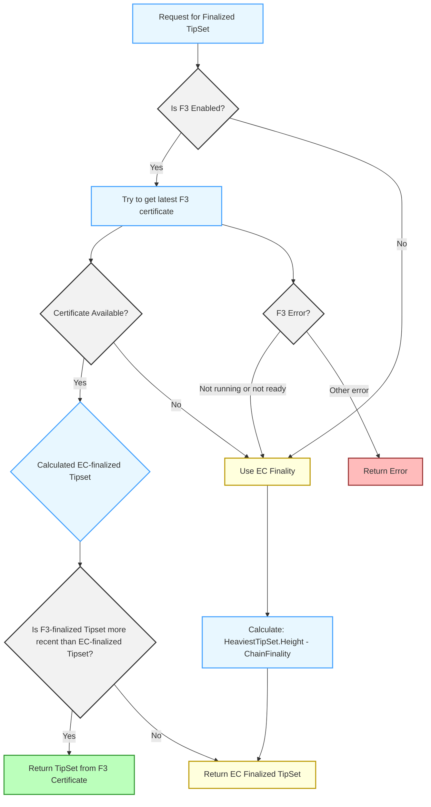

> [!NOTE]
> This is a staging area for these docs so they can be made under source control with review.
> The current published home is https://filoznotebook.notion.site/Filecoin-V2-APIs-1d0dc41950c1808b914de5966d501658
> Changes to this doc should be propagated back there to allow for easier discovery and user commenting.

# Filecoin V2 APIs <!-- omit from toc -->

# Meta
## Status
- 2025-09-19: Update to account for the F3-awareness that was added to `/v1` APIs in Lotus v1.34.0.  This was reviewed in PR [#13352](https://github.com/filecoin-project/lotus/pull/13352).
- 2025-08-29: Updated to summarize the difference between `/v1` and `/v2`.  This was reviewed in PR [#13284](https://github.com/filecoin-project/lotus/pull/13284).
- 2025-06-06: Updated to make clear the impact on the APIs if F3 isn't finalizing or if the latest F3-finalized tipset is older than the latest EC-finalized tipset. This was reviewed in [PR #13161](https://github.com/filecoin-project/lotus/pull/13161).
- 2025-04-24: This document has been updated to include information about Eth APIs in `/v2`.  This was reviewed in [PR #13068](https://github.com/filecoin-project/lotus/pull/13068).
- 2025-04-23: This document has been updated to account for the minimum initial set of non-Eth /v2 API groups as specified in [issue #12991](https://github.com/filecoin-project/lotus/issues/12991).  This was reviewed in [PR #13051](https://github.com/filecoin-project/lotus/pull/13051)
- 2025-04-09: This document is still actively a Work In Progress. It has a draft discussing `ChainGetTipSet`. Additional APIs and API Groups will be added as part of working on [issue #12987](https://github.com/filecoin-project/lotus/issues/12987).

## Table of Contents

<!-- 
This table of contents is present to make it easier to see structural changes in diffs (assuming a new change also updates the ToC).
When copying this to Notion, the table of contents can be removed, and a Notion ToC can be inserted instead.
This ToC was generated using [Markdown All in One](https://marketplace.visualstudio.com/items?itemName=yzhang.markdown-all-in-one)
-->

- [Meta](#meta)
  - [Status](#status)
  - [Table of Contents](#table-of-contents)
- [Introduction](#introduction)
- [The Selector Pattern](#the-selector-pattern)
- [Chain](#chain)
  - [ChainGetTipSet](#chaingettipset)
    - [Selector Types](#selector-types)
    - [1. By Tag](#1-by-tag)
    - [2. By Height](#2-by-height)
    - [3. By Key](#3-by-key)
    - [Response](#response)
    - [Error Handling](#error-handling)
- [State](#state)
  - [StateGetActor](#stategetactor)
    - [Parameters](#parameters)
    - [Request Example](#request-example)
    - [Response](#response-1)
  - [StateGetID](#stategetid)
    - [Parameters](#parameters-1)
    - [Request Example](#request-example-1)
    - [Response](#response-2)
  - [Ethereum (Eth)](#ethereum-eth)
    - [Examples](#examples)
- [Consensus Protocol Notes](#consensus-protocol-notes)
  - [Understanding `finalized` TipSets](#understanding-finalized-tipsets)
    - [Node Configuration Impact](#node-configuration-impact)
    - [Graceful Fallback Mechanism](#graceful-fallback-mechanism)
    - [Example: Retrieving `finalized` TipSet](#example-retrieving-finalized-tipset)
  - [Understanding `safe` TipSets](#understanding-safe-tipsets)
    - [Implementation and Calculation](#implementation-and-calculation)
    - [Conservative Safety Margin](#conservative-safety-margin)
    - [Example: Retrieving `safe` TipSet](#example-retrieving-safe-tipset)
    - [Anchors and Default Behaviour](#anchors-and-default-behaviour)
    - [Benefits for Application Development](#benefits-for-application-development)
- [Appendix](#appendix)
  - [JSON-RPC Examples](#json-rpc-examples)
    - [1. Get Latest TipSet](#1-get-latest-tipset)
    - [2. Get Finalized TipSet](#2-get-finalized-tipset)
    - [3. Get Safe TipSet](#3-get-safe-tipset)
    - [4. Get TipSet at Specific Height](#4-get-tipset-at-specific-height)
    - [5. Get TipSet by Key](#5-get-tipset-by-key)
    - [6. Error Response Example (Invalid Selector)](#6-error-response-example-invalid-selector)
  - [Advanced Usage Examples](#advanced-usage-examples)
    - [Working with TipSet Anchors and Dealing with Null Epochs](#working-with-tipset-anchors-and-dealing-with-null-epochs)
    - [JSON-RPC Examples Combining Anchors and Previous Flag](#json-rpc-examples-combining-anchors-and-previous-flag)
      - [Example 1: Get a tipset at a specific height, with previous fallback, anchored to finalized chain](#example-1-get-a-tipset-at-a-specific-height-with-previous-fallback-anchored-to-finalized-chain)
      - [Example 2: Get *exactly* the tipset at a specific height (no fallback), anchored to latest chain](#example-2-get-exactly-the-tipset-at-a-specific-height-no-fallback-anchored-to-latest-chain)
      - [Example 3: Get a tipset with previous fallback, anchored to a specific TipSet key](#example-3-get-a-tipset-with-previous-fallback-anchored-to-a-specific-tipset-key)
    - [Common Use Cases](#common-use-cases)
      - [Walking Backwards Through a Chain](#walking-backwards-through-a-chain)
      - [Handling Network Instability Periods](#handling-network-instability-periods)
      - [Checking for Reorganisation with Exact Height Comparison](#checking-for-reorganisation-with-exact-height-comparison)
  - [Go SDK Example Usage](#go-sdk-example-usage)
    - [Predefined Selectors and Anchors in the Go SDK](#predefined-selectors-and-anchors-in-the-go-sdk)
  - [Consistency Across Selector Usage](#consistency-across-selector-usage)
    - [Avoiding Inconsistent State Views](#avoiding-inconsistent-state-views)
    - [Risk of Double Counting or Missing State Changes](#risk-of-double-counting-or-missing-state-changes)
  - [Practical Applications](#practical-applications)
    - [Chain Synchronisation](#chain-synchronisation)
    - [Transaction Confirmation](#transaction-confirmation)
    - [Historical Data Analysis](#historical-data-analysis)
    - [Chain Reorganisation Detection](#chain-reorganisation-detection)
    - [Actor Information Retrieval](#actor-information-retrieval)
    - [Address Resolution](#address-resolution)
  - [Design decisions](#design-decisions)
    - [Why aren't named parameters used?](#why-arent-named-parameters-used)
    - [What happens if F3 is not finalizing the chain?](#what-happens-if-f3-is-not-finalizing-the-chain)
    - [What happens if the latest F3-finalized tipset is behind the latest EC-finalized tipset?](#what-happens-if-the-latest-f3-finalized-tipset-is-behind-the-latest-ec-finalized-tipset)
  - [Future API Groups](#future-api-groups)
    - [State API Group](#state-api-group)
    - [Mpool API Group](#mpool-api-group)
    - [Wallet API Group](#wallet-api-group)
  - [Resources and References](#resources-and-references)
    - [Official Documentation](#official-documentation)
    - [GitHub Links](#github-links)
    - [Community](#community)


# Introduction

The Filecoin V2 APIs represent a significant redesign of Filecoin's RPC interface for non-ETH APIs with several important goals in mind:

1. **User-Friendly Interface**: The APIs provide intuitive ways to interact with the Filecoin network without requiring deep technical knowledge of its internals.
2. **Expressive Selection Mechanisms**: Through the Selector pattern, users can clearly express what data they want using criteria that make sense for their use case.
3. **Smaller API Footprint**: By using flexible selectors, we've reduced the number of distinct API methods needed, consolidating functionality into fewer, more powerful endpoints.
4. **F3 Awareness**: The APIs are fully aware of Filecoin Fast Finality (F3) and can automatically adapt to provide the appropriate finality guarantees based on the node's consensus protocol.
5. **Future Extensibility**: The design allows for extending selection criteria without breaking existing functionality or requiring new API methods.

ETH APIs have also been updated with F3 awareness for the `finalized` and `safe` tags (see [Ethereum (Eth)](#ethereum-eth)).

| Group | Dimension | `/v1` | `/v2` |
| --- | --- | --- | --- |
| non-ETH APIs | F3 awareness | ☑️ Only `ChainGetFinalizedTipSet` | ✅ |
|  | Selector pattern | ❌ | ✅ |
|  | Stable | ✅ | Experimental.  There are no known changes to make, but we’ll make breaking changes in response to user feedback. |
|  | Support level | Full.  Critical bugs can trigger emergency patch releases.  Backwards compatibility is a chief concern. | Very responsive to any feedback or bugs, and bugs impacting production usage can trigger an emergency patch release.  Backwards compatibility isn’t a concern currently until we get more feedback on the API. |
|  | Footprint | Large as has accumulated bloat over the years. | Small.  There is a lot of functionality from `/v1` that doesn’t have a `v2` equivalent yet. |
| ETH APIs | F3 awareness | ✅ :`finalized` and `safe` tags consult the F3 subsystem (see [Ethereum (Eth)](#ethereum-eth)). | ✅ Same |
|  | Support level | Full | Same  |
|  | Footprint | See [Lotus Ethereum API Compatibility](https://www.notion.so/filecoindev/Lotus-Ethereum-API-Compatibility-1d0dc41950c180cc8c3ecc9033d56cc7)  | Same.  Any `/v1` ETH APIs are supported in `/v2`. |

# The Selector Pattern

At the core of the V2 APIs design is the concept of "Selectors" - flexible constructs that let you specify exactly what blockchain data you want. Rather than having different methods for different selection criteria, a single method accepts various selector types to retrieve data in different ways.

This documentation focuses on the `TipSetSelector` as implemented in the `ChainGetTipSet`, `StateGetActor`, and `StateGetID` methods. Additional API groups are under development, including:

- **State API Group**: Will provide enhanced state query capabilities with similar selector patterns
- **Mpool API Group**: Will offer improved message pool interaction
- **Wallet API Group**: Will introduce more powerful wallet operations

Each API group follows the same design principles of extensibility, expressiveness, and F3 awareness while minimising the API surface area.

# Chain

The Chain method group contains methods for interacting with the blockchain, allowing you to query various aspects of the Filecoin blockchain.

## ChainGetTipSet

```
Filecoin.ChainGetTipSet
```

**Description**: Retrieves a tipset that corresponds to the specified selector criteria.

**Permissions**: read

### Selector Types

The API introduces a flexible way to select tipsets using different criteria:

1. **By Tag** - Using predefined references like `latest`, `safe`, or `finalized`.
2. **By Height** - Selecting a tipset at a specific blockchain height, optionally anchored to a reference point.
3. **By Key** - Directly specifying a tipset by its cryptographic key (an array of block CIDs).

### 1. By Tag

Tags provide convenient shortcuts to commonly desired tipsets:

```json
{
  "tag": "latest"
}
```

or

```json
{
  "tag": "finalized"
}
```

or

```json
{
  "tag": "safe"
}
```

**JSON-RPC Request Example:**

```json
{
  "jsonrpc": "2.0",
  "method": "Filecoin.ChainGetTipSet",
  "params": [
    {
      "tag": "latest"
    }
  ],
  "id": 1
}
```

Where:
- `"latest"` - Returns the most recent tipset in the chain with the heaviest weight. This gives the most up-to-date view but has the lowest finality guarantee.
- `"finalized"` - Returns the most recent tipset considered final by the node based on its consensus protocol (F3 or EC fallback). This provides the strongest finality guarantee but is the least recent. See [Consensus Protocol Notes](#understanding-finalized-tipsets) for details.
- `"safe"` - Returns a tipset balancing recency and finality, calculated based on `max(finalized_height, latest_height - SafeHeightDistance)`, where `SafeHeightDistance` is currently 200 epochs. It's guaranteed to be *at least* as recent as the `finalized` tipset. If the calculated height corresponds to a null tipset (an epoch without blocks), the API returns the first non-null parent tipset. See [Consensus Protocol Notes](#understanding-safe-tipsets) for more details.

### 2. By Height

Selects a tipset at a specific blockchain height (epoch):

```json
{
  "height": {
    "at": 123456,
    "previous": true,
    "anchor": {
      "tag": "finalized"
    }
  }
}
```

**JSON-RPC Request Example:**

```json
{
  "jsonrpc": "2.0",
  "method": "Filecoin.ChainGetTipSet",
  "params": [
    {
      "height": {
        "at": 123456,
        "previous": true,
        "anchor": {
          "tag": "finalized"
        }
      }
    }
  ],
  "id": 1
}
```

Where:
- `at` (integer) - The chain epoch to retrieve. Must be non-negative.
- `previous` (boolean, optional) - If `true` and the tipset at the specified `at` height is null, returns the first non-null parent tipset (at height `< at`). If `false` or omitted, it returns the tipset exactly at the specified `at` height; this might be `null` if no blocks were mined at that epoch. Default is `false`.
- `anchor` (TipSetSelector, optional) - Specifies a reference point (using a `tag` like `latest`, `safe`, `finalized`, or a specific `key`) for the chain history to search within. The selected tipset is guaranteed to be a descendant of this anchor. Defaults to the `finalized` tipset if unspecified, ensuring queries follow the finalized chain by default.

### 3. By Key

Selects a tipset using its unique cryptographic key (an array of block CIDs):

```json
{
  "key": [{
    "/": "bafy2bzacecmargpnize7vt4vfj7ownecbkue6q23eucrn3kvg4rdd54ym77cy"
  }]
}
```

**JSON-RPC Request Example:**

```json
{
  "jsonrpc": "2.0",
  "method": "Filecoin.ChainGetTipSet",
  "params": [
    {
      "key": [{
        "/": "bafy2bzacecmargpnize7vt4vfj7ownecbkue6q23eucrn3kvg4rdd54ym77cy"
      }]
    }
  ],
  "id": 1
}
```

Where `key` is an array containing the CIDs that uniquely identify the desired tipset.

### Response

The method returns a TipSet object if found.

**JSON-RPC Response Example:**

```json
{
  "jsonrpc": "2.0",
  "result": {
    "Cids": [
      {
        "/": "bafy2bzacecn2av5bgezy7kid2n26hv5rpccxlajvbfk3cilkgswhagdpnt7eq"
      },
      {
        "/": "bafy2bzaceaqoc5zakbapciic6vkd3p7qgu74252lg642uivcofz4kowbj2s3a"
      }
    ],
    "Blocks": [
      {
        "Miner": "f01234",
        "Height": 123456,
        "Timestamp": 1640995200
        // Additional block data omitted for brevity
      },
      {
        "Miner": "f02468",
        "Height": 123456,
        "Timestamp": 1640995215
        // Additional block data omitted for brevity
      }
    ],
    "Height": 123456
  },
  "id": 1
}
```

If a tipset cannot be found matching the criteria (e.g., using `height` with `previous: false` for a null epoch, or an invalid key), the result might be `null` or an error, depending on the specific case.

### Error Handling

The API will return an error in the following cases:

- No selector is provided (selector must be explicitly specified).
- Multiple top-level selection criteria are specified (e.g., both `tag` and `height`). Note: `anchor` *within* `height` is allowed.
- Invalid height values (e.g., negative `at` value).
- Invalid key format or non-existent key.
- Other validation errors with the selector specification.

# State

The State method group contains methods for interacting with the Filecoin blockchain state, including actor information, addresses, and chain data. These methods allow querying the blockchain state at any point in its history using the same flexible TipSet selection mechanisms used in the Chain API group.

## StateGetActor

```
Filecoin.StateGetActor
```

**Description**: Retrieves the actor information (like balance, nonce, code CID) for the specified address at the state defined by the selected tipset.

**Permissions**: read

### Parameters

1. `address` (string) - The Filecoin address (e.g., "f01234", "f2...") to look up.
2. `tipsetSelector` (TipSetSelector) - A selector specifying which tipset's state to query (e.g., `{"tag": "safe"}`, `{"height": {"at": 123456}}`).

### Request Example

```json
{
  "jsonrpc": "2.0",
  "method": "Filecoin.StateGetActor",
  "params": [
    "f01234",
    {
      "tag": "finalized"
    }
  ],
  "id": 1
}
```

This example retrieves the actor information for address `f01234` at the finalized tipset.

### Response

The method returns an Actor object containing:

- `Code` (CID) - Determines the actor's type (e.g., account, miner, multisig).
- `Head` (CID) - The root CID of the actor's state.
- `Nonce` (uint64) - The transaction count for account actors.
- `Balance` (string) - The actor's balance in attoFIL.
- `DelegatedAddress` (string, optional) - If the actor has a delegated address (like f4 addresses), it will be present here.

**JSON-RPC Response Example:**

```json
{
  "jsonrpc": "2.0",
  "result": {
    "Code": {
      "/": "bafk2bzacebp3lhba2jem4ze27hvzkao3r5z5zpeiq4qmx6b3waqoqpqzpoky2" // Example Account Actor Code CID
    },
    "Head": {
      "/": "bafy2bzaceahypovebb3jbnp2zhrtwgetb7afsbefp2yrsedcnmv4bwhzotkwy" // Example Actor State CID
    },
    "Nonce": 42,
    "Balance": "1000000000000000000" // 1 FIL
  },
  "id": 1
}

```

If the actor does not exist at the specified tipset state, an error is returned (e.g., "actor not found").

## StateGetID

```
Filecoin.StateGetID
```

**Description**: Retrieves the canonical ID address (e.g., "f01234") for the specified address at the state defined by the selected tipset.

**Permissions**: read

### Parameters

1. `address` (string) - The Filecoin address (ID, robust, or delegated) to resolve.
2. `tipsetSelector` (TipSetSelector) - A selector specifying which tipset's state to query.

### Request Example

```json
{
  "jsonrpc": "2.0",
  "method": "Filecoin.StateGetID",
  "params": [
    "f2kc5mnx4pvgdpm5lzgutbfuzcnmkedlgd5wvyky", // A robust address
    {
      "tag": "latest" // Resolve based on the latest chain state
    }
  ],
  "id": 1
}
```

This example resolves the given robust address to its ID address at the latest tipset.

### Response

The method returns the ID address (string) corresponding to the input address at the specified tipset.

**JSON-RPC Response Example:**

```json
{
  "jsonrpc": "2.0",
  "result": "f01234", // The resolved ID address
  "id": 1
}
```

If the address cannot be resolved to an ID address at the specified tipset state (e.g., it never existed or was created after that tipset), an error is returned.

## Ethereum (Eth)

The V2 API namespace includes all the Ethereum (Eth) APIs that `/v1` supports.  As of Lotus v1.34.0, both `/v1` and `/v2` have had the `finalized` and `safe` tags updated to consult the F3 subsystem (if enabled) for finality information.  `finalized` and `safe` for the "Eth" APIs has the same meaning and fallback outlined in  [Consensus Protocol Notes](#consensus-protocol-notes).  In addition, `safe` will look back a maximum 200 epochs.

For a complete list of available Eth methods in V2, refer to the [V2 autogenerated documentation](https://github.com/filecoin-project/lotus/blob/master/documentation/en/api-methods-v2-experimental.md#eth).

### Examples
**Example: getting an Eth block by number using the `finalized` tag:**

```json
{
  "jsonrpc": "2.0",
  "method": "Eth.GetBlockByNumber",
  "params": [
    "finalized",
    true
  ],
  "id": 1
}
```

**Example: retrieving account balance at a `safe` block:**

```json
{
  "jsonrpc": "2.0",
  "method": "Eth.GetBalance",
  "params": [
    "0x5cbeecf99d3fdb3f25e309cc264f240bb0664031",
    "safe"
  ],
  "id": 1
}
```

# Consensus Protocol Notes

The Filecoin network is currently in the process of testing and activating Filecoin Fast Finality (F3), a new consensus mechanism that provides faster finality guarantees. During this transition period, the network will contain a mix of nodes - some with F3 enabled and others still using only the traditional Expected Consensus (EC) finality mechanism.

This heterogeneous environment creates potential challenges for applications that need consistent finality information. The V2 APIs address this by implementing graceful fallback mechanisms that ensure a smooth API experience regardless of a node's configuration. While EC finality will always be available as a reliable fallback, the APIs are designed to automatically use F3 when available, handling edge cases transparently for the application developer.
This approach ensures that applications can be built today that will seamlessly benefit from improved finality as F3 adoption increases across the network, without requiring code changes or special handling of different node types.

## Understanding `finalized` TipSets

The `finalized` tag is a powerful concept in the V2 APIs that returns the tipset considered finalized by the node's consensus protocol. This enables applications to work with confirmed blockchain data without needing to understand the underlying finality mechanism.

### Node Configuration Impact

How the `finalized` tag behaves depends on the node's configuration:

1. **When F3 is Enabled and Ready**:
    - The API returns whichever tipset is most recent between:
       - The tipset identified by the latest F3 certificate OR
       - The latest EC-finalized tipset 
    - In practice this almost always means the tipset identified by the latest F3 certificate since F3 provides much faster finality guarantees (typically within minutes).
    - The exception of falling back to an EC-finalized tipset would occur if there is a larger network issue and F3 has stalled for ~7.5 hours ([example](https://github.com/filecoin-project/lotus/issues/13094)).
2. **When F3 is Disabled or Not Ready**:
    - The API automatically falls back to EC finality.
    - EC finality is based on chain depth (currently 900 epochs, or ~7.5 hours).
    - The finalized tipset is calculated as: `heaviestTipSet.Height - policy.ChainFinality`.

### Graceful Fallback Mechanism

The implementation includes several fallback scenarios to ensure robust operation:



This graceful fallback ensures that the `finalized` tag always returns a meaningful result regardless of the node's configuration or the state of the F3 subsystem.

### Example: Retrieving `finalized` TipSet

```json
{
  "jsonrpc": "2.0",
  "method": "Filecoin.ChainGetTipSet",
  "params": [
    {
      "tag": "finalized"
    }
  ],
  "id": 1
}
```

With this request:

- If F3 is enabled and ready: you'll get the F3-finalized tipset (potentially minutes old).
- If F3 is disabled or not ready: you'll get the EC-finalized tipset (typically hours old).

## Understanding `safe` TipSets

The `safe` tag provides a balance between the most recent data (`latest`) and the most secure, finalized data (`finalized`). It returns a tipset that is potentially more recent than the finalized tipset but still offers a reasonable level of stability against minor chain reorganizations.

### Implementation and Calculation

The `safe` tag effectively selects a tipset at a height calculated as:

`max(finalized_tipset_height, latest_tipset_height - SafeHeightDistance)`

Where:

1. `finalized_tipset_height` is the height of the tipset returned by the `finalized` selector.
2. `latest_tipset_height` is the height of the tipset returned by the `latest` selector.
3. `SafeHeightDistance` is a safety buffer defined in the node's build configuration (currently **200 epochs**, approx. 100 minutes).

This calculation guarantees that the `safe` tipset is **never older than the `finalized` tipset** and is very likely more recent.

If the calculated safe height corresponds to a null tipset (an epoch without blocks), the system returns the **first non-null parent tipset**, similar to using a height selector with `previous: true`.

### Conservative Safety Margin

The current `SafeHeightDistance` of 200 epochs is a conservative value chosen to balance recency with stability during the initial rollout. This value:

- Provides stronger guarantees against near-tip reorganizations than `latest`.
- May be adjusted in future versions based on network analysis and consensus evolution.  
- A tracking item for documenting the probability of finality at different heights behind head is [go-f3#944](https://github.com/filecoin-project/go-f3/issues/944).

### Example: Retrieving `safe` TipSet

```json
{
  "jsonrpc": "2.0",
  "method": "Filecoin.ChainGetTipSet",
  "params": [
    {
      "tag": "safe"
    }
  ],
  "id": 1
}
```

With this request you'll get a tipset that:
- Is no more than 200 epochs behind the latest tipset
- Is at least as recent as the finalized tipset
- Represents a pragmatic balance between stability and recency

### Anchors and Default Behaviour

When using height-based selectors (`{"height": {...}}`) with no explicit `anchor` specified, the API defaults to using the `finalized` tag as the anchor.

```json
{
  "jsonrpc": "2.0",
  "method": "Filecoin.ChainGetTipSet",
  "params": [
    {
      "height": {
        "at": 123456,
        "previous": true
        // No anchor specified - defaults to using "finalized" as the anchor
      }
    }
  ],
  "id": 1
}
```

This default ensures that height-based queries follow the most stable, finalized chain history unless explicitly overridden. You can explicitly set the `anchor` to use `latest`, `safe`, or a specific TipSet `key` if you need to query relative to a different point in the chain's history.

### Benefits for Application Development

The flexible tag system (`latest`, `safe`, `finalized`) provides several advantages:

1. **Clear Intent**: Easily express whether you need the absolute newest (`latest`), a recent-but-safer point (`safe`), or full confirmation (`finalized`).
2. **Abstraction from Finality Mechanisms**: Applications don't need detailed knowledge of F3 or EC when using `finalized` or `safe`.
3. **Consistent Behaviour**: API behaves predictably regardless of underlying network consensus configuration.
4. **Future-Proof**: As Filecoin evolves, these core concepts remain stable.
5. **Performance/Confidence Trade-offs**: Applications can easily choose the right balance:
    - `latest`: Fastest access, lowest stability.
    - `safe`: Good balance of recency and stability.
    - `finalized`: Highest stability, potentially highest latency.

# Appendix

## JSON-RPC Examples

### 1. Get Latest TipSet

**Request:**

```json
{
  "jsonrpc": "2.0",
  "method": "Filecoin.ChainGetTipSet",
  "params": [
    {
      "tag": "latest"
    }
  ],
  "id": 1
}
```

### 2. Get Finalized TipSet

**Request:**

```json
{
  "jsonrpc": "2.0",
  "method": "Filecoin.ChainGetTipSet",
  "params": [
    {
      "tag": "finalized"
    }
  ],
  "id": 1
}
```

### 3. Get Safe TipSet

**Request:**

```json
{
  "jsonrpc": "2.0",
  "method": "Filecoin.ChainGetTipSet",
  "params": [
    {
      "tag": "safe"
    }
  ],
  "id": 1
}
```

### 4. Get TipSet at Specific Height

**Request:**

```json
{
  "jsonrpc": "2.0",
  "method": "Filecoin.ChainGetTipSet",
  "params": [
    {
      "height": {
        "at": 123456,
        "previous": true, // Get previous non-null if 123456 is null
        "anchor": {       // Search within the finalized chain history
          "tag": "finalized"
        }
      }
    }
  ],
  "id": 3
}
```

### 5. Get TipSet by Key

**Request:**

```json
{
  "jsonrpc": "2.0",
  "method": "Filecoin.ChainGetTipSet",
  "params": [
    {
      "key": [{
        "/": "bafy2bzacecmargpnize7vt4vfj7ownecbkue6q23eucrn3kvg4rdd54ym77cy"
      }]
    }
  ],
  "id": 4
}
```

### 6. Error Response Example (Invalid Selector)

**Request:**

```json
{
  "jsonrpc": "2.0",
  "method": "Filecoin.ChainGetTipSet",
  "params": [
    {
      "height": {
        "at": -100,
        "previous": true
      }
    }
  ],
  "id": 5
}
```

**Response:**

```json
{
  "jsonrpc": "2.0",
  "error": {
    "code": -32602, // Invalid params
    "message": "invalid tipset height: epoch cannot be less than zero"
  },
  "id": 5
}
```

## Advanced Usage Examples

### Working with TipSet Anchors and Dealing with Null Epochs

When retrieving TipSets from the Filecoin blockchain, the `anchor` and `previous` options within the `height` selector provide powerful control:

**Anchors** (`anchor`) allow you to specify which chain history to follow when retrieving a TipSet at a particular height (`at`). This is crucial because forks can occur. Anchoring ensures your query returns a TipSet that is a descendant of your chosen reference point. Compared to V1 APIs, anchors often reduce the number of API calls needed. You can specify either a `tag` (`latest`, `safe`, `finalized`) or a specific TipSet `key` as your anchor. If omitted, it defaults to `finalized`.

The **Previous Flag** (`previous`) addresses the challenge of null epochs – heights where no blocks were mined.

- When `previous: true`:
    - If a TipSet exists *at* the requested `at` height (on the anchored chain), it's returned.
    - If no TipSet exists at the `at` height, the API automatically finds and returns the first non-null parent TipSet *before* that height (i.e., at height `< at`), following the specified anchor's chain history.
- When `previous: false` (or omitted):
    - The API attempts to retrieve the TipSet *exactly* at the `at` height (on the anchored chain).
    - If that height contains blocks, the TipSet is returned.
    - If that height is a null epoch, the API will likely return `null` or an error indicating the tipset was not found at that exact height.

Using `previous: true` simplifies walking backwards through the chain, automatically skipping null epochs. Using `previous: false` is useful when you need to know specifically if a given height contained blocks or was null.

### JSON-RPC Examples Combining Anchors and Previous Flag

#### Example 1: Get a tipset at a specific height, with previous fallback, anchored to finalized chain

```json
{
  "jsonrpc": "2.0",
  "method": "Filecoin.ChainGetTipSet",
  "params": [
    {
      "height": {
        "at": 123456,
        "previous": true,       // Fallback enabled
        "anchor": {             // Relative to finalized chain history
          "tag": "finalized"
        }
      }
    }
  ],
  "id": 1
}
```

*Meaning*: "Give me the TipSet at height 123456 on the finalized chain. If height 123456 is null, give me the first non-null TipSet *before* it on that same chain."

#### Example 2: Get *exactly* the tipset at a specific height (no fallback), anchored to latest chain

```json
{
  "jsonrpc": "2.0",
  "method": "Filecoin.ChainGetTipSet",
  "params": [
    {
      "height": {
        "at": 123456,
        "previous": false,      // No fallback
        "anchor": {             // Relative to latest (heaviest) chain history
          "tag": "latest"
        }
      }
    }
  ],
  "id": 2
}
```

*Meaning*: "Give me whatever is at exactly height 123456 on the latest (heaviest) chain. If that height is null, return a null result or error."

#### Example 3: Get a tipset with previous fallback, anchored to a specific TipSet key

```json
{
  "jsonrpc": "2.0",
  "method": "Filecoin.ChainGetTipSet",
  "params": [
    {
      "height": {
        "at": 123456,
        "previous": true,       // Fallback enabled
        "anchor": {             // Relative to the chain containing this specific tipset
          "key": [{
            "/": "bafy2bzacecmargpnize7vt4vfj7ownecbkue6q23eucrn3kvg4rdd54ym77cy"
          }]
        }
      }
    }
  ],
  "id": 1
}
```

*Meaning*: "Find the chain containing the tipset identified by the given key. On that chain, give me the TipSet at height 123456. If that height is null on that chain, give me the first non-null TipSet *before* it."

### Common Use Cases

#### Walking Backwards Through a Chain

Use `previous: true` with a decreasing `at` height and a fixed `anchor` (like a specific starting TipSet `key` or `"finalized"`) to efficiently traverse history, automatically skipping null epochs.

```json
{
  "jsonrpc": "2.0",
  "method": "Filecoin.ChainGetTipSet",
  "params": [
    {
      "height": {
        "at": 100000,
        "previous": true,
        "anchor": {
          "key": [{
            "/": "bafy2bzacecmargpnize7vt4vfj7ownecbkue6q23eucrn3kvg4rdd54ym77cy"
          }]
        }
      }
    }
  ],
  "id": 1
}
```

#### Handling Network Instability Periods

If you suspect recent instability near the chain head, using `"safe"` or `"finalized"` as a tag or anchor provides more stable reference points than `"latest"`. To get the last known good state *before* a certain point known to be problematic:
```json
{
  "jsonrpc": "2.0",
  "method": "Filecoin.ChainGetTipSet",
  "params": [
    {
      "height": {
        "at": 200000,
        "previous": true,
        "anchor": {
          "tag": "finalized"
        }
      }
    }
  ],
  "id": 1
}
```

#### Checking for Reorganisation with Exact Height Comparison

To detect if the block(s) at a *specific* height have changed (indicating a reorg affecting that height), query with `previous: false` anchored to `"latest"` at two different times and compare the resulting TipSet keys.
```json
{
  "jsonrpc": "2.0",
  "method": "Filecoin.ChainGetTipSet",
  "params": [
    {
      "height": {
        "at": 123456,
        "previous": false,
        "anchor": {
          "tag": "latest"
        }
      }
    }
  ],
  "id": 1
}
```

## Go SDK Example Usage

The Filecoin V2 APIs provide a well-structured Go SDK that makes it easy to interact with the TipSet selectors.

### Predefined Selectors and Anchors in the Go SDK

The Go SDK (`github.com/filecoin-project/lotus/chain/types`) provides convenient predefined constants and factory functions to create selectors easily:

```go
// Using predefined tag selectors
latestSelector := types.TipSetSelectors.Latest       // Get the latest tipset
safeSelector := types.TipSetSelectors.Safe           // Get the save tipset
finalizedSelector := types.TipSetSelectors.Finalized // Get the finalized tipset

// Creating height-based selectors with the factory function
heightSelector := types.TipSetSelectors.Height(123, true, nil)  // Height 123, with previous fallback
anchoredHeight := types.TipSetSelectors.Height(123, true, types.TipSetAnchors.Finalized)  // Anchored to finalized tipset

// Creating key-based selectors with the factory function
keySelector := types.TipSetSelectors.Key(someTipSetKey)  // Select by specific TipSetKey

// Anchor constants for height-based selectors
latestAnchor := types.TipSetAnchors.Latest     // Anchor to latest tipset
safeAnchor := types.TipSetAnchors.Safe         // Anchor to safe tipset
finalizedAnchor := types.TipSetAnchors.Finalized // Anchor to finalized tipset
keyAnchor := types.TipSetAnchors.Key(someTipSetKey) // Anchor to specific key

_, err = node.ChainGetTipSet(ctx, someSelector)
```

These predefined selectors, anchors, and factory functions handle the internal complexity, making your Go code cleaner and less error-prone when interacting with the V2 APIs.

## Consistency Across Selector Usage

### Avoiding Inconsistent State Views

When working with blockchain data, particularly for operations involving multiple state reads (like checking balances across accounts or calculating totals), it's crucial to maintain consistency in how you select the reference tipset. Using selectors (`latest` vs `safe` vs `finalized`) or querying at different points in time for related data can lead to inconsistent views of the state and incorrect results.

### Risk of Double Counting or Missing State Changes

Consider this scenario where inconsistent selector usage leads to double counting of funds:

1. A user has two accounts:
    - Account1 initially contains 5 FIL
    - Account2 initially contains 0 FIL
2. A transaction is created that transfers 5 FIL from Account1 to Account2
3. The transaction is included in the latest tipset but has not yet been finalised
4. Application queries Account1 using the `finalized` selector at Time T1
    - This returns 5 FIL (because at the finalised tipset, the transfer hasn't happened yet)
5. A new finality certificate is produced, finalising the transfer transaction
6. Application queries Account2 using the `finalized` selector at Time T2 (after new finalisation)
    - This returns 5 FIL (because now the transfer is finalised)
7. If the application adds these balances, it would incorrectly conclude the user has 10 FIL total, when they actually have 5 FIL

To avoid such inconsistencies, whether in financial applications or any application requiring strong consistency guarantees across multiple state reads, **lock to a specific TipSetKey** by:  
1. Retrieve a specific TipSet using a chosen selector (e.g., `finalized`, `safe`, or a specific `height`).
2. Extract its `TipSetKey` (the array of CIDs).
3. Use *that same key* via `TipSetSelectors.Key(retrievedKey)` for *all* related state queries (e.g., `StateGetActor`, `StateGetID`) within that logical operation.
This ensures all queries operate on the exact same snapshot of the blockchain state.

## Practical Applications

### Chain Synchronisation

Track blockchain progress by periodically querying the `latest` tipset and comparing its height.

**JSON-RPC Request:**
```json
{
  "jsonrpc": "2.0",
  "method": "Filecoin.ChainGetTipSet",
  "params": [
    {
      "tag": "latest"
    }
  ],
  "id": 1
}
```

### Transaction Confirmation

Wait for a transaction's effects to be reflected in the state queried at a `finalized` tipset to ensure it's practically irreversible.

**JSON-RPC Request:**
```json
{
  "jsonrpc": "2.0",
  "method": "Filecoin.ChainGetTipSet",
  "params": [
    {
      "tag": "finalized"
    }
  ],
  "id": 1
}
```
(Then search messages/receipts or query actor state using this tipset key).


### Historical Data Analysis

Retrieve tipsets or query state at specific heights to analyze historical blockchain data, using an appropriate `anchor` (often `finalized` or a specific key) and `previous` flag.

**JSON-RPC Request:**
```json
{
  "jsonrpc": "2.0",
  "method": "Filecoin.StateGetActor",
  "params": [
    "f0123", // Example address
    {
      "height": {
        "at": 100000,
        "previous": true,
        "anchor": {
          "tag": "finalized"
        }
      }
    }
  ],
  "id": 1
}
```

### Chain Reorganisation Detection

Compare the TipSet keys returned by querying the *same height* anchored to `latest` at different times. If the key changes, a reorg has affected that height.

**JSON-RPC Request (repeated over time):**
```json
{
  "jsonrpc": "2.0",
  "method": "Filecoin.ChainGetTipSet",
  "params": [
    {
      "height": {
        "at": 123456,
        "previous": false,
        "anchor": {
          "tag": "latest"
        }
      }
    }
  ],
  "id": 1 // Use different IDs for subsequent requests
}
```

### Actor Information Retrieval

Retrieve actor information to check balance, nonce, or actor type:

**JSON-RPC Request:**

```json
{
  "jsonrpc": "2.0",
  "method": "Filecoin.StateGetActor",
  "params": [
    "f01234",
    {
      "tag": "finalized"
    }
  ],
  "id": 1
}
```

### Address Resolution

Resolve an address (e.g., robust `f2...` or delegated `f4...`) to its canonical ID (`f0...`).

**JSON-RPC Request:**
```json
{
  "jsonrpc": "2.0",
  "method": "Filecoin.StateGetID",
  "params": [
    "f2kc5mnx4pvgdpm5lzgutbfuzcnmkedlgd5wvyky", // Example robust address
    {
      "height": {
        "at": 123456,
        "previous": true,
        "anchor": {
          "tag": "finalized"
        }
      }
    }
  ],
  "id": 1
}
```

## Design decisions

The design for these `/v2` APIs happened as a result of [issue #12987](https://github.com/filecoin-project/lotus/issues/12987) and the resulting subtasks and their linked PRs (in particular [issue #12990](https://github.com/filecoin-project/lotus/issues/12990)). Some of the larger design decisions and their rationale are extracted here.

### Why aren't named parameters used?

JSON-RPC allows named parameters (using a JSON object instead of an array for `params`), but positional parameters (using a JSON array) were chosen for the Filecoin V2 APIs. These comments are lifted directly from PR feedback discussions:

- *Usage*: Named parameters are not widely used in practice across various JSON-RPC implementations.
- *Tooling Compatibility*: Most existing tooling (Lotus' internal JSON-RPC library, `lotus-shed rpc`, client libraries in other languages) primarily expects and works best with positional parameters.
- *Simplicity*: While named parameters can sometimes improve readability for complex calls, positional parameters are simpler to implement and parse consistently. Client-side abstractions can easily map more readable function calls to positional parameters if desired.

### What happens if F3 is not finalizing the chain?
The `/v2` APIs rely on F3 data even if F3 is not yet finalizing the chain (i.e., `EC.Finalize` is `false` in the live F3 manifest used by all participants). To determine if F3 is actively finalizing, call the `F3GetManifest` API and check if `Manifest.EC.Finalize` is `true`. Only when `EC.Finalize` is `true` will the `/v2` `"finalized"` and `"safe"` tags accurately reflect the chain's finality according to F3. That said, as of epoch 4919580 on mainnet, F3 is finalized and this shouldn't be a concern.

### What happens if the latest F3-finalized tipset is behind the latest EC-finalized tipset?
Per [understanding Finalized TipSets](#understanding-finalized-tipsets), the most most recent finalized TipSet will be returned.  When F3 is enabled, we almost always expect this to be a tipset to be finalized.  But in nthe event that F3 is stalled for enough time, we could fallback to returning a TipSet finalized by EC.


## Future API Groups

The Filecoin V2 APIs initiative will expand beyond the Chain, State, and Eth API groups demonstrated in this document. Each API group will follow the same principles of using selectors for expressive queries while maintaining a minimal API surface.

### State API Group

*(Planned - example methods)*
The State API group will provide methods for querying the Filecoin state tree with powerful selector mechanisms:

- **StateGetState**: Get detailed state objects with customisable state selectors (e.g., querying specific fields within an actor's state HAMT).
- **StateSearchMsg**: Search for messages with expressive message selectors (e.g., by `From`, `To`, `Method`, within a height range anchored to a tipset).

### Mpool API Group

*(Planned - example methods)*
The Mpool API group will offer improved message pool interaction with:

- **MpoolSelect**: Query message pool with configurable filters and priorities (e.g., select top N messages by gas premium for a specific sender).
- **MpoolTrack**: Monitor message pool changes with subscription-based selectors (e.g., notify when a message matching specific criteria appears).

### Wallet API Group

*(Planned - example methods)*
The Wallet API group will provide enhanced wallet operations:

- **WalletSelect**: Find wallet addresses using flexible criteria (e.g., find all addresses with balance > X).
- **WalletTransact**: Create transactions with comprehensive parameter selectors (e.g., construct a multisig transaction proposal).

Like the TipSet API demonstrated in this document, each planned API group will support the "selector pattern" to provide powerful, expressive, and future-proof interfaces to the Filecoin network while being fully F3-aware.

## Resources and References

### Official Documentation

- [Filecoin Documentation](https://docs.filecoin.io/)
- [Lotus Documentation](https://lotus.filecoin.io/docs/)

### GitHub Links

- [Filecoin V2 APIs Umbrella Issue (#12987)](https://github.com/filecoin-project/lotus/issues/12987)
- [Filecoin V2 APIs TipSet Selector Issue (#12990)](https://github.com/filecoin-project/lotus/issues/12990)
- [TipSet Selector Implementation PR (#13003)](https://github.com/filecoin-project/lotus/pull/13003)
- [Initial State APIs Implementation PR (#13027)](https://github.com/filecoin-project/lotus/pull/13027)
- [`safe` Tag Implementation PR (#13034)](https://github.com/filecoin-project/lotus/pull/13034)

### Community

- [Filecoin Slack](https://filecoin.io/slack)
- [Filecoin Forum](https://discuss.filecoin.io/)
