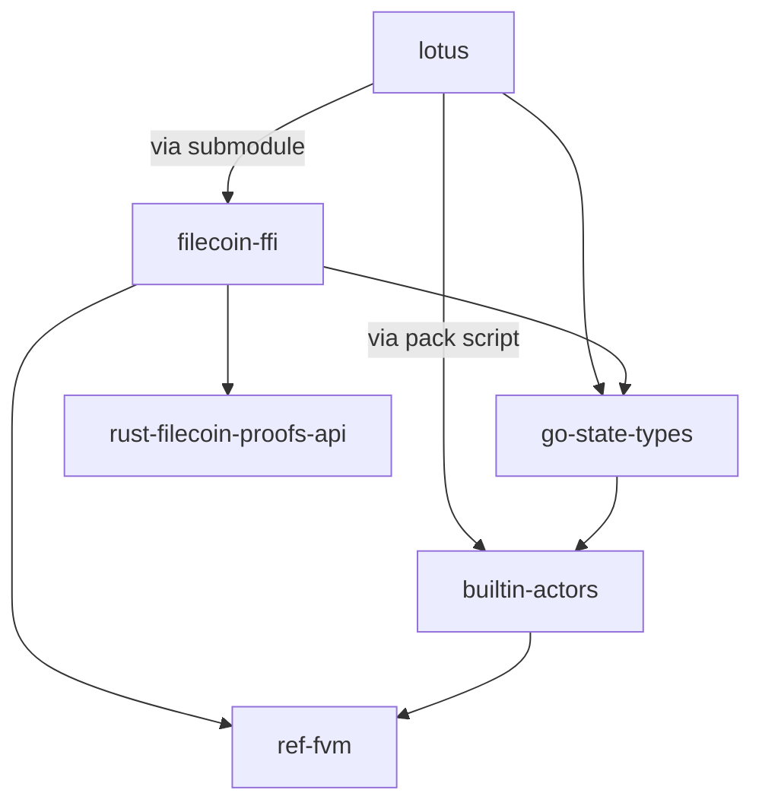

# Network Upgrade Skeleton in Lotus <!-- omit in toc -->

This guide will walk you through the process of creating a skeleton for a network upgrade in Lotus. 

- [Context](#context)
  - [Network Upgrade Dependency Versions](#network-upgrade-dependency-versions)
  - [Network Upgrade Dependency Relationships](#network-upgrade-dependency-relationships)
- [Setup](#setup)
- [Ref-FVM Checklist](#ref-fvm-checklist)
- [Go-State-Types Checklist](#go-state-types-checklist)
- [Filecoin-FFI Checklist](#filecoin-ffi-checklist)
- [Lotus Checklist](#lotus-checklist)
- [Special Cases](#special-cases)
  - [New types in go-state-types](#new-types-in-go-state-types)

Each repository has its own set of steps that need to be followed. This guide provides detailed instructions for each repository in the proper order.

## Context

### Network Upgrade Dependency Versions
There are these versions at play for a network upgrade:
- Network Version: an incrementing integer prefixed with `nv` that corresponds with the hard fork that Filecoin implementations coordinate around (e.g., nvX).
- FVM Version: The ref-fvm crate version (e.g., FVM_MAJOR_VERSION.y.x).
- Lotus Version: The Lotus go.mod version (e.g., 1.LOTUS_MINOR_VERSION.x).
- Actor Version: The incrementing integer that is associated with a builtin-actors bundle.

### Network Upgrade Dependency Relationships


The table below gives an overview of how Lotus and its critical dependencies relate to each other and are versioned relative to network versions.

| Repo | <div style="width:250px">For every network upgrade (increase in Network Version)...</div> | Versioning Scheme | Versioning Docs | go.mod direct dependencies | cargo.toml direct dependencies | Other direct dependencies |
| --- | --- | --- | --- | --- | --- | --- |
| `lotus` | There is at least one `lotus` minor version. [^0] | <small>1.LOTUS_MINOR_VERSION.x</small> | [link](https://github.com/filecoin-project/lotus/blob/master/LOTUS_RELEASE_FLOW.md#adopted-conventions) | `go-state-types` | n/a | * `filecoin-ffi` via git submodule<br/>* `builtin-actors` via pack script |
| `filecoin-ffi` | There is at least one `filecoin-ffi` minor version (since `filecoin-ffi` tracks `lotus`). | <small>1.LOTUS_MINOR_VERSION.x</small> | [link](https://github.com/filecoin-project/filecoin-ffi?tab=readme-ov-file#versioning) | `go-state-types` | * `ref-fvm`<br/>* `rust-filecoin-proofs-api` | None |
| `go-state-types` | There are zero or one `go-state-types` minor versions (since `go-state-types` minor versions track `builtin-actors` major versions) | <small>0.ACTORS_VERSION.x</small> | [link](https://github.com/filecoin-project/go-state-types?tab=readme-ov-file#versioning) | None | n/a | None |
| `builtin-actors` | There are zero or one actors major versions (i.e., we can have a new network upgrade without an actors bump) | <small>ACTORS_VERSION.0.x</small> | [link](https://github.com/filecoin-project/builtin-actors?tab=readme-ov-file#versioning) | n/a |`ref-fvm` | None |
| `ref-fvm` | There may be a major version bump. If there isn't, there is at least a minor version bump to enable support for the new network version. | <small>FVM_ MAJOR_VERSION.y.x</small> | [link](https://github.com/filecoin-project/ref-fvm?tab=readme-ov-file#versioning) | n/a | None | None |

[^0]: Exceptional case of no Lotus minor version for when we have two-stage upgrades where one network version enables some new feature and the next version disables the deprecated feature.

## Setup

1. Create a tracking issue for this effort:

   Title: Skeleton for nvXX to support development and testing
   Body:

````
## Done Criteria
There is a network skeleton in Lotus, which bubbles up all the other dependencies, and allows one to run a 2k-network and see that it switches network version from nv(XX-1) --> nvXX

## Notes
1. This is the overarching tracking issue for the network skeleton update, but there are tasks that need to be completed in other repos as well.  All PRs for this effort can reference this issue.
2. How to create a skeleton in Lotus is documented here: https://github.com/filecoin-project/lotus/blob/master/documentation/misc/Building_a_network_skeleton.md

```[tasklist]
## Tasks
- [ ] Skeleton for nv24 to support development and testing ref-fvm
- [ ] Skeleton for nv24 to support development and testing go-state-types
- [ ] Skeleton for nv24 to support development and testing filecoin-ffi
- [ ] Skeleton for nv24 to support development and testing Lotus
```

````

2. Clone Repos
   1. [ref-fvm](https://github.com/filecoin-project/ref-fvm.git)
   2. [go-state-types](https://github.com/filecoin-project/go-state-types)
   3. [filecoin-ffi](https://github.com/filecoin-project/filecoin-ffi.git)
   4. [lotus](https://github.com/filecoin-project/lotus)

## Ref-FVM Checklist

1. Add support for the new network version in Ref-FVM:

    - In `fvm/Cargo.toml` add `nvXX-dev` as a feature flag in the [features]-section.
    - In `fvm/src/gas/price_list.rs`, extend the `price_list_by_network_version` function to support the new network version with the `nvXX-dev` feature flag.
    - In fvm/src/machine/default.rs, locate the new function within your machine context. You'll find a SUPPORTED_VERSIONS constant that sets the range of supported network versions. Update this range to include the new network version. Do this by replacing the existing feature flag nvXX-dev and NetworkVersion::VXX with the new ones corresponding to your new network version.
    - In `shared/src/version/mod.rs`, in the `NetworkVersion` implementation, you will find a series of constants representing different network versions. To add a new network version, you need to declare a new constant: `pub const (VXX+1): Self = Self(XX+1);` 

You can take a look at [this Ref-FVM PR as a reference](https://github.com/filecoin-project/ref-fvm/pull/2029), which added the skeleton for network version 24. You can also check out the [releasing primary FVM crates checklist here](https://github.com/filecoin-project/ref-fvm/blob/master/CONTRIBUTING.md#primary-fvm-crates)

2. In a separate PR bump the Ref-FVM version:

    - Bump the version in the root Cargo.toml file.
    - Bump the fvm, fvm_shared and fvm_sdk versions in the `workspace` section in `ref-fvm/cargo.toml`
        1. `fvm→version`
        2. `fvm_shared→version`
        3. `fvm_sdk→version`
        4. `fvm_integration_tests→version`
    - Update the cargo.lock file by running `cargo check --all`
    - Make sure the `CHANGELOG.md` files in each of `fvm`, `sdk`, and `shared` are all up-to-date (look
   through `git log -- path/to/crate`), set the release date & version, and add a new "Unreleased"
   section. It may be appropriate to duplicate some entries across these crates if the changes are
   relevant to multiple crates.

You can take a look at [this PR as a reference](https://github.com/filecoin-project/ref-fvm/pull/2030).

3. Wait for the PR to be merged and the reviewer to [publish a new release](https://github.com/filecoin-project/ref-fvm/blob/master/CONTRIBUTING.md#releasing).

## Go-State-Types Checklist

1. Follow the [go-state-types actor version checklist](https://github.com/filecoin-project/go-state-types/blob/master/actors_version_checklist.md):

    - Setup
        ```bash
        # export these environment variables so they can read in the commands below
        export CURRENT_VERSION=vXX # e.g., v14
        export NEW_VERSION=vXX+1 # e.g., v15
        ```
    - Copy `go-state-types/builtin/vXX` to `go-state-types/builtin/v(XX+1)`.
        ```bash
        cp -r builtin/$CURRENT_VERSION builtin/$NEW_VERSION
        ```
    - Make a commit with this change.  That way the followup commit(s) will be separated out from the copy/paste change for easier reviewing.
    - Change all references from vXX to v(XX+1) in the new files.
        ```bash
        # Find all the files that have a reference to vXX
        # Update them to vXX+1
        # "sed -i=''" is done for macOS compatibility per https://stackoverflow.com/questions/12272065/sed-undefined-label-on-macos
        find builtin/$NEW_VERSION -type f -exec sh -c 'grep -q "builtin/$CURRENT_VERSION" "$1" && sed -i='' "s/builtin\/$CURRENT_VERSION/builtin\/$NEW_VERSION/g" "$1" && echo "$1"' _ {} \;
        ```
    - Add new network version to `network/version.go`.
    - Add new actors version to `actors/version.go`.
        - Add `Version(XX+1) Version = XX+1` as a constant.
        - In `func VersionForNetwork` add `case network.Version(XX+1): return Version(XX+1), nil`.
    - Add the new version to the gen step of the makefile.
        - Add `$(GO_BIN) run ./builtin/v(XX+1)/gen/gen.go`.
    - Commit the above changes with a `create base nvXX+1 skeleton` message so its easier to review.
    - In /builtin/vXX+1/migration, delete all the migration files that are specific to the previous network upgrade:
    - Commit the above changes with a `Delete migration specific for nvXX` message so its easier to review.
    - Check your `/builtin/vXX+1/check.go` file, and see if there is any Invariant TODOs that stems from the previous migration that needs to be cleaned up.

    👉 You can take a look at this [Go-State-Types PR as a reference](https://github.com/filecoin-project/go-state-types/pull/299), which added the skeleton for network version 24.

2. In a second PR based off your first PR, add a simple migration for the network upgrade:

    - Copy the system.go template [^1], and add it to your `/builtin/vXX+1/migration` folder.
    - Copy the top.go template [^2], and add it to your `/builtin/vXX+1/migration` folder.

    👉 You can take a look at this [Go-State-Types PR as a reference](https://github.com/filecoin-project/go-state-types/pull/304), which added a simple migration for network version 24.

3. [Follow the release process](https://github.com/filecoin-project/go-state-types#release-process) to publish `v0.NEW_VERSION.0-dev`

    👉 You can take a look at this [Go-State-Types PR as a reference](https://github.com/filecoin-project/go-state-types/pull/306), which was for network version 24.

## Filecoin-FFI Checklist

1. Update the `TryFrom<u32>` implementation for `EngineVersion` in `rust/src/fvm/engine.rs`
    - Add the new network version number (XX+1) to the existing match arm for the network version.

2. Patch the FVM-dependency (fvm4 and fvm4_shared) in `rust/cargo.toml` to use the newly published Ref-FVM release.
    -  Add `features = ["nvXX+1-dev"]`.

    👉 You can take a look at this [Filecoin-FFI PR as a reference](https://github.com/filecoin-project/filecoin-ffi/pull/479), which added the skeleton for network version 24.

3.  [Follow the release process](https://github.com/filecoin-project/filecoin-ffi/blob/master/RELEASE.md) to publish `v1.NEW_LOTUS_MINOR_VERSION.0-dev`

    👉 You can take a look at this [Filecoin-FFI PR as a reference](https://github.com/filecoin-project/filecoin-ffi/pull/481), which was for network version 24.

Note: one only needs to update `filecoin-ffi`'s dependency on `go-state-types` when a network upgrade is introducing new types in `go-state-types`  (see [below](#new-types-in-go-state-types)).  Otherwise, `filecoin-ffi`'s dependency on `go-state-types` is just updated when doing final releases before the network upgrade.

## Lotus Checklist

1. To integrate the network skeleton into Lotus, ensure that the relevant releases for ref-fvm, go-state-types, and filecoin-ffi are bubbled up to Lotus.
    - Refer to the [Update Dependencies Lotus tutorial](Update_Dependencies_Lotus.md) for detailed instructions on updating these dependencies in Lotus.

2. Import new actors:

    - Create a mock actor-bundle for the new network version.
    - In `/build/actors` run `./pack.sh vXX+1 vXX.0.0` where XX is the current actor bundle version.

3. Define upgrade heights in `build/params_`:

    - Update the following files:
        - `params_2k.go`
            - Set previous `UpgradeXxHeight = abi.ChainEpoch(-xx-1)`
            - Add `var UpgradeXxHeight = abi.ChainEpoch(200)`
            - Add `UpgradeXxHeight = getUpgradeHeight("LOTUS_XX_HEIGHT", UpgradeXXHeight)`
            - Set `const GenesisNetworkVersion = network.VersionXX` where XX is the network version you are upgrading from.
        - `params_butterfly.go`
            - set previous upgrade to `var UpgradeXxHeigh = abi.ChainEpoch(-xx-1)`
            - Add comment with ?????? signaling that the new upgrade date is unknown
            - Add `const UpgradeXxHeight = 999999999999999`
            - Set `const GenesisNetworkVersion = network.VersionXX` where XX is the network version you are upgrading from.
        - `params_calibnet.go`
            - Add comment with `??????` signaling that the new upgrade date is unknown
            - Add `const UpgradeXxHeight = 999999999999999`
        - `params_interop.go`
            - set previous upgrade to `var UpgradeXxHeigh = abi.ChainEpoch(-xx-1)`
            - Add `const UpgradeXxHeight = 50`
        - `params_mainnet.go`
            - Set previous upgrade to `const UpgradeXxHeight = XX`
            - Add comment with ???? signaling that the new upgrade date is unknown
            - Add `var UpgradeXxHeight = abi.ChainEpoch(9999999999)`
            - Change the `LOTUS_DISABLE_XX` env variable to the new network name
        - `params_testground.go`
            - Add `UpgradeXxHeight     abi.ChainEpoch = (-xx-1)`

4. Generate adapters:

    - Update `gen/inlinegen-data.json`.
        - Add `XX+1` to "actorVersions" and set "latestActorsVersion" to `XX+1`.
        - Add `XX+1` to "networkVersions" and set "latestNetworkVersion" to `XX+1`.

    - Run `make actors-gen`. This generates the `/chain/actors/builtin/*` code, `/chain/actors/policy/policy.go` code, `/chain/actors/version.go`, and `/itest/kit/ensemble_opts_nv.go`.

5. Update `chain/consensus/filcns/upgrades.go`.
    - Import `nv(XX+1) "github.com/filecoin-project/go-state-types/builtin/v(XX+1)/migration`.
    - Add Schedule. [^3]
    - Add Migration. [^4]

6. Add actorstype to the NewActorRegistry in `/chain/consensus/computestate.go`.
    - Add `inv.Register(actorstypes.Version(XX+1), vm.ActorsVersionPredicate(actorstypes.Version(XX+1)), builtin.MakeRegistry(actorstypes.Version(XX+1))`.

7. Add upgrade field to `api/types.go/ForkUpgradeParams`.
    - Add `UpgradeXxHeight      abi.ChainEpoch` to `ForkUpgradeParams` struct.

8. Add upgrade to `node/impl/full/state.go`.
    - Add `UpgradeXxHeight:      build.UpgradeXxHeight,`.

9. Add network version to `chain/state/statetree.go`.
    - Add `network.VersionXX+1` to `VersionForNetwork` function.

10. Copy the latest version case block in `cmd/lotus-shed/invariants.go`, paste it below and increment the network version number.

11. In the [getMigrationFuncsForNetwork](https://github.com/filecoin-project/lotus/blob/4f63a0860542140e1efd7045ca49cab3463f6761/cmd/lotus-shed/migrations.go#L283-L301) function, add a new case for the latest network version, and create the corresponding `checkNvXXInvariants` function.

12. Run `make gen`.

13. Run `make docsgen-cli`.

14. Validate the network skeleton on a devnet by:
  - Have a local developer network that starts at the current network version.  See docs at https://docs.filecoin.io/networks/local-testnet .  
  - Be able to see the Actor CIDs/Actor version for the mock Actor-bundle through `lotus state actor-cids --network-version XX+1`
  - Have a successful pre-migration.
  - Complete the migration at upgrade epoch, with a successful upgrade.
  - Sync the new network version with the mock actor bundle, and be able to see that you are on a new network version with `lotus state network-version`

15. Post a PR with the changes and include the local devnet output.
   - [nv24 example](https://github.com/filecoin-project/lotus/pull/12455)
   - [nv27 example](https://github.com/filecoin-project/lotus/pull/13125)

And you're done 🎉! This creates a basis where you can start testing new FIPs. 

## Special Cases

### New types in go-state-types
Typically it's safe to not upgrade filecoin-ffi's version of go-state-types.  The exception is when we add a new type (e.g., a new proof variant).  In that case, filecoin-ffi needs to be tracking the dev/rc releases of go-state-types.  During network skeleton time, any new `go-state-type` types are likely not known, so even if one needs to bump the `filecoin-ffi` version of `go-state-types` to a development/rc release, that will come later in the network upgrade process.

---
[^1]: Here is system.go template for a simple migration:

    ```go
    package migration

    import (
        "context"

        system14 "github.com/filecoin-project/go-state-types/builtin/v14/system"

        "github.com/filecoin-project/go-state-types/migration"

        "github.com/ipfs/go-cid"
        cbor "github.com/ipfs/go-ipld-cbor"
    )

    // System Actor migrator
    type systemActorMigrator struct {
        OutCodeCID   cid.Cid
        ManifestData cid.Cid
    }

    func (m systemActorMigrator) MigratedCodeCID() cid.Cid {
        return m.OutCodeCID
    }

    func (m systemActorMigrator) MigrateState(ctx context.Context, store cbor.IpldStore, in migration.ActorMigrationInput) (*migration.ActorMigrationResult, error) {
        // The ManifestData itself is already in the blockstore
        state := system14.State{BuiltinActors: m.ManifestData}
        stateHead, err := store.Put(ctx, &state)
        if err != nil {
            return nil, err
        }

        return &migration.ActorMigrationResult{
            NewCodeCID: m.OutCodeCID,
            NewHead:    stateHead,
        }, nil
    }

    func (m systemActorMigrator) Deferred() bool {
        return false
    }
    ```

[^2]: Here is top.go template for a simple migration:

    ```go
    package migration

    import (
        "context"

        adt14 "github.com/filecoin-project/go-state-types/builtin/v14/util/adt"

        system13 "github.com/filecoin-project/go-state-types/builtin/v13/system"

        "github.com/filecoin-project/go-state-types/abi"
        "github.com/filecoin-project/go-state-types/builtin"
        "github.com/filecoin-project/go-state-types/manifest"
        "github.com/filecoin-project/go-state-types/migration"

        "github.com/ipfs/go-cid"
        cbor "github.com/ipfs/go-ipld-cbor"
        "golang.org/x/xerrors"
    )

    // MigrateStateTree Migrates the filecoin state tree starting from the global state tree and upgrading all actor state.
    // The store must support concurrent writes (even if the configured worker count is 1).
    func MigrateStateTree(ctx context.Context, store cbor.IpldStore, newManifestCID cid.Cid, actorsRootIn cid.Cid, priorEpoch abi.ChainEpoch, cfg migration.Config, log migration.Logger, cache migration.MigrationCache) (cid.Cid, error) {
        if cfg.MaxWorkers <= 0 {
            return cid.Undef, xerrors.Errorf("invalid migration config with %d workers", cfg.MaxWorkers)
        }

        adtStore := adt14.WrapStore(ctx, store)

        // Load input and output state trees
        actorsIn, err := builtin.LoadTree(adtStore, actorsRootIn)
        if err != nil {
            return cid.Undef, xerrors.Errorf("loading state tree: %w", err)
        }

        // load old manifest data
        systemActor, ok, err := actorsIn.GetActorV5(builtin.SystemActorAddr)
        if err != nil {
            return cid.Undef, xerrors.Errorf("failed to get system actor: %w", err)
        }

        if !ok {
            return cid.Undef, xerrors.New("didn't find system actor")
        }

        var systemState system13.State
        if err := store.Get(ctx, systemActor.Head, &systemState); err != nil {
            return cid.Undef, xerrors.Errorf("failed to get system actor state: %w", err)
        }

        var oldManifestData manifest.ManifestData
        if err := store.Get(ctx, systemState.BuiltinActors, &oldManifestData); err != nil {
            return cid.Undef, xerrors.Errorf("failed to get old manifest data: %w", err)
        }

        // load new manifest
        var newManifest manifest.Manifest
        if err := adtStore.Get(ctx, newManifestCID, &newManifest); err != nil {
            return cid.Undef, xerrors.Errorf("error reading actor manifest: %w", err)
        }

        if err := newManifest.Load(ctx, adtStore); err != nil {
            return cid.Undef, xerrors.Errorf("error loading actor manifest: %w", err)
        }

        // Maps prior version code CIDs to migration functions.
        migrations := make(map[cid.Cid]migration.ActorMigration)
        // Set of prior version code CIDs for actors to defer during iteration, for explicit migration afterwards.
        deferredCodeIDs := make(map[cid.Cid]struct{})

        for _, oldEntry := range oldManifestData.Entries {
            newCodeCID, ok := newManifest.Get(oldEntry.Name)
            if !ok {
                return cid.Undef, xerrors.Errorf("code cid for %s actor not found in new manifest", oldEntry.Name)
            }
            migrations[oldEntry.Code] = migration.CachedMigration(cache, migration.CodeMigrator{OutCodeCID: newCodeCID})
        }

        // migrations that migrate both code and state, override entries in `migrations`

        // The System Actor

        newSystemCodeCID, ok := newManifest.Get(manifest.SystemKey)
        if !ok {
            return cid.Undef, xerrors.Errorf("code cid for system actor not found in new manifest")
        }

        migrations[systemActor.Code] = systemActorMigrator{OutCodeCID: newSystemCodeCID, ManifestData: newManifest.Data}

        if len(migrations)+len(deferredCodeIDs) != len(oldManifestData.Entries) {
            return cid.Undef, xerrors.Errorf("incomplete migration specification with %d code CIDs, need %d", len(migrations)+len(deferredCodeIDs), len(oldManifestData.Entries))
        }

        actorsOut, err := migration.RunMigration(ctx, cfg, cache, store, log, actorsIn, migrations)
        if err != nil {
            return cid.Undef, xerrors.Errorf("failed to run migration: %w", err)
        }

        outCid, err := actorsOut.Flush()
        if err != nil {
            return cid.Undef, xerrors.Errorf("failed to flush actorsOut: %w", err)
        }

        return outCid, nil
    }
    ```

[^3]: Here is an example of how you can add a schedule:

    ```go
    {
        Height:    build.UpgradeXxHeight,
        Network:   network.Version(XX+1),
        Migration: UpgradeActorsV(XX+1),
        PreMigrations: []stmgr.PreMigration{{
            PreMigration:    PreUpgradeActors(VXX+1),
            StartWithin:     120,
            DontStartWithin: 15,
            StopWithin:      10,
        }},
        Expensive: true,
    },
    ```

    This schedule should be added to the `DefaultUpgradeSchedule` function, specifically within the `updates` array.

[^4]: Here is an example of how you can add a migration:

    ```go
    func PreUpgradeActorsV(XX+1)(ctx context.Context, sm *stmgr.StateManager, cache stmgr.MigrationCache, root cid.Cid, epoch abi.ChainEpoch, ts *types.TipSet) error {
        // Use half the CPUs for pre-migration, but leave at least 3.
        workerCount := MigrationMaxWorkerCount
        if workerCount <= 4 {
            workerCount = 1
        } else {
            workerCount /= 2
        }

        lbts, lbRoot, err := stmgr.GetLookbackTipSetForRound(ctx, sm, ts, epoch)
        if err != nil {
            return xerrors.Errorf("error getting lookback ts for premigration: %w", err)
        }

        logPeriod, err := getMigrationProgressLogPeriod()
        if err != nil {
            return xerrors.Errorf("error getting progress log period: %w", err)
        }

        config := migration.Config{
            MaxWorkers:        uint(workerCount),
            ProgressLogPeriod: logPeriod,
        }

        _, err = upgradeActorsV(XX+1)Common(ctx, sm, cache, lbRoot, epoch, lbts, config)
        return err
    }

    func UpgradeActorsV(XX+1)(ctx context.Context, sm *stmgr.StateManager, cache stmgr.MigrationCache, cb stmgr.ExecMonitor,
        root cid.Cid, epoch abi.ChainEpoch, ts *types.TipSet) (cid.Cid, error) {
        // Use all the CPUs except 2.
        workerCount := MigrationMaxWorkerCount - 3
        if workerCount <= 0 {
            workerCount = 1
        }

        logPeriod, err := getMigrationProgressLogPeriod()
        if err != nil {
            return cid.Undef, xerrors.Errorf("error getting progress log period: %w", err)
        }

        config := migration.Config{
            MaxWorkers:        uint(workerCount),
            JobQueueSize:      1000,
            ResultQueueSize:   100,
            ProgressLogPeriod: logPeriod,
        }
        newRoot, err := upgradeActorsV(XX+1)Common(ctx, sm, cache, root, epoch, ts, config)
        if err != nil {
            return cid.Undef, xerrors.Errorf("migrating actors vXX state: %w", err)
        }
        return newRoot, nil
    }

    func upgradeActorsV(XX+1)Common(
        ctx context.Context, sm *stmgr.StateManager, cache stmgr.MigrationCache,
        root cid.Cid, epoch abi.ChainEpoch, ts *types.TipSet,
        config migration.Config,
    ) (cid.Cid, error) {
        writeStore := blockstore.NewAutobatch(ctx, sm.ChainStore().StateBlockstore(), units.GiB/4)
        adtStore := store.ActorStore(ctx, writeStore)
        // ensure that the manifest is loaded in the blockstore
        if err := bundle.LoadBundles(ctx, writeStore, actorstypes.Version(XX+1)); err != nil {
            return cid.Undef, xerrors.Errorf("failed to load manifest bundle: %w", err)
        }

        // Load the state root.
        var stateRoot types.StateRoot
        if err := adtStore.Get(ctx, root, &stateRoot); err != nil {
            return cid.Undef, xerrors.Errorf("failed to decode state root: %w", err)
        }

        if stateRoot.Version != types.StateTreeVersion5 {
            return cid.Undef, xerrors.Errorf(
                "expected state root version 5 for actors vXX+1 upgrade, got %d",
                stateRoot.Version,
            )
        }

        manifest, ok := actors.GetManifest(actorstypes.Version(XX+1))
        if !ok {
            return cid.Undef, xerrors.Errorf("no manifest CID for vXX+1 upgrade")
        }

        // Perform the migration
        newHamtRoot, err := nv(XX+1).MigrateStateTree(ctx, adtStore, manifest, stateRoot.Actors, epoch, config,
            migrationLogger{}, cache)
        if err != nil {
            return cid.Undef, xerrors.Errorf("upgrading to actors vXX+1: %w", err)
        }

        // Persist the result.
        newRoot, err := adtStore.Put(ctx, &types.StateRoot{
            Version: types.StateTreeVersion5,
            Actors:  newHamtRoot,
            Info:    stateRoot.Info,
        })
        if err != nil {
            return cid.Undef, xerrors.Errorf("failed to persist new state root: %w", err)
        }

        // Persists the new tree and shuts down the flush worker
        if err := writeStore.Flush(ctx); err != nil {
            return cid.Undef, xerrors.Errorf("writeStore flush failed: %w", err)
        }

        if err := writeStore.Shutdown(ctx); err != nil {
            return cid.Undef, xerrors.Errorf("writeStore shutdown failed: %w", err)
        }

        return newRoot, nil
    }
    ```
