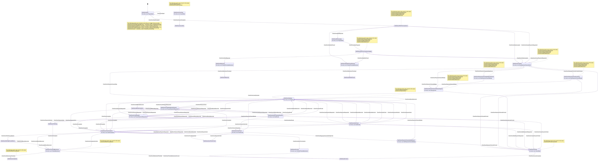
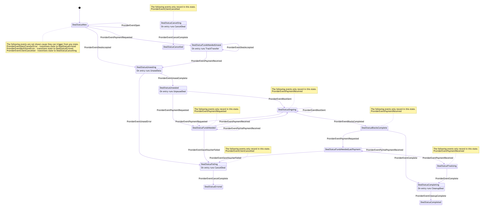

# retrievalmarket
The retrievalmarket module is intended for Filecoin node implementations written in Go.
It implements functionality to allow execution of retrieval market deals on the
Filecoin network.
The node implementation must provide access to chain operations, and persistent 
data storage.

## Table of Contents
* [Background reading](#Background-reading)
* [Installation](#Installation)
* [Operation](#Operation)
* [Implementation](#Implementation)
    * [Peer Resolver](#Peer_Resolver)
    * [RetrievalClientNode](#RetrievalClientNode)
    * [RetrievalProviderNode](#RetrievalProviderNode)
* [Construction](#Construction)
    * [Construct a RetrievalClient](#RetrievalClient)
    * [Construct a RetrievalProvider](#RetrievalProvider)
* [Technical Documentation](#technical-documentation)

## Background reading
Please see the 
[Filecoin Retrieval Market Specification](https://filecoin-project.github.io/specs/#systems__filecoin_markets__retrieval_market).

## Installation
The build process for retrievalmarket requires Go >= v1.13.

To install:
```bash
go get github.com/filecoin-project/go-fil-markets/retrievalmarket
```

## Operation

The `retrievalmarket` package provides high level APIs to execute data retrieval deals between a
 retrieval client and a retrieval
 provider (a.k.a. retrieval miner) on the Filecoin netwwork. 
 The node must implement the `PeerResolver`, `RetrievalProviderNode`, and
     `RetrievalClientNode` interfaces in order to construct and use the module.

Deals are expected to survive a node restart; deals and related information are
 expected to be stored on disk.
 
`retrievalmarket` communicates its deal operations and requested data via 
[go-data-transfer](https://github.com/filecoin-project/go-data-transfer) using 
[go-graphsync](https://github.com/ipfs/go-graphsync).
    
Once required Node APIs are implemented and the retrievalmarket APIs are exposed to your desired
 consumers (such as a command-line or web interface), a retrieval from the client side could
proceed roughly like so:
1. Your node has a record of data with payloadCIDs and their respective pieceCIDs. Someone,
possibly you, wants to retrieve data referenced by `paylaodCID`.
1. It calls `PeerResolver.GetPeers` to obtain a list of retrieval providers storing data
 referenced by `payloadCID`. 
1. It obtains retrieval deal terms by calling each retrieval miners' `Query` function.
1. The node selects the best terms for a retrieval deal and initiates a deal by calling
  the retrieval client's `Retrieve` function with the selected retrieval miner and piece info.
1. The deal then proceeds automatically until all the data is returned and full payment in the
   form of vouchers is made to the retrieval provider, or the deal errors.
1. Once the deal is complete and the final payment voucher is posted to chain, your client account balance
  will be  adjusted according to the terms of the deal.

A retrieval from the provider side is more automated; the RetrievalProvider would be listening
 for retrieval Query and Retrieve requests, and respond accordingly.

1. Your node stores a record of what it has stored locally, or possibly a record of peers
 with data.
1. Your node receives a Query for `payloadCID` and responds automatically with the terms you the
 node operator have set for retrieval deals.
1. Your node receives a DealProposal for retrieval, and automatically validates and accepts or
 rejects it. If accepted, the deal proceeds and your node begins sending data in pieces, stopping
  every so often to request another voucher for a greater value.
1. Once the deal is complete and your node has received a voucher sufficient to cover the entire
data transfer, you the node operator may then redeem the voucher and collect FIL.

### Collecting FIL for a deal is the node's responsibility
To collect your FIL, your node must send on-chain
messages directly to the payment channel actor to send all the vouchers, 
Settle, and Collect on the deal. This will finalize the client and provider balances for the
retrieval deal on the Filecoin blockchain. Implementation and timing of these calls is the node's
responsibility and is not a part of `retrievalmarket`. For more information about how 
to interact with the
payment channel actor, see the 
[github.com/filecoin-project/specs-actors](https://github.com/filecoin-project/specs-actors) repo.

## Implementation

### General Steps
1. Decide if your node can be configured as a Retrieval Provider, a Retrieval Client or both.
1. Determine how and where your retrieval calls to RetrievalProvider and RetrievalClient functions
 will be made.
1. Implement the required interfaces as described in this section.
1. [Construct a RetrievalClient](#RetrievalClient) in your node's startup, if your
 node will be a client.
1. [Construct a RetrievalProvider](#RetrievalProvider) in your node's startup, if your
 node will be a provider.
If setting up a RetrievalProvider, call its `Start` function it in the appropriate place, and its
 `Stop` function in the appropriate place.
1. Expose desired `retrievalmarket` functionality to whatever internal modules desired, such as
 command line interface, JSON RPC, or HTTP API.

Implement the [`PeerResolver`](#PeerResolver), [`RetrievalProviderNode`](#RetrievalProviderNode), 
and [`RetrievalClientNode`](#RetrievalClientNode)
interfaces in [retrievalmarket/types.go](./types.go), described below:

### PeerResolver
PeerResolver is an interface for looking up providers that may have a piece of identifiable 
data. Its functions are:

#### GetPeers
```go
func GetPeers(payloadCID cid.Cid) ([]RetrievalPeer, error)
```
Return a slice of RetrievalPeers that store the data referenced by `payloadCID`.

---
### RetrievalClientNode

`RetrievalClientNode` contains the node dependencies for a RetrievalClient. Its functions are:

* [`AllocateLane`](#AllocateLane)
* [`GetChainHead`](#GetChainHead)
* [`GetOrCreatePaymentChannel`](#GetOrCreatePaymentChannel)
* [`CreatePaymentVoucher`](#CreatePaymentVoucher)
* [`WaitForPaymentChannelAddFunds`](#WaitForPaymentChannelAddFunds)
* [`WaitForPaymentChannelCreation`](#WaitForPaymentChannelCreation)

#### AllocateLane
```go
func AllocateLane(paymentChannel address.Address) (uint64, error)
```

Create a lane within `paymentChannel` so that calls to CreatePaymentVoucher will 
automatically make vouchers only for the difference in total. Note that payment channel 
Actors have a
[lane limit](https://github.com/filecoin-project/specs-actors/blob/0df536f7e461599c818231aa0effcdaccbb74900/actors/builtin/paych/paych_actor.go#L20).

#### CreatePaymentVoucher
```go
func CreatePaymentVoucher(ctx context.Context, paymentChannel address.Address, 
                         amount abi.TokenAmount, lane uint64, tok shared.TipSetToken
                         ) (*paych.SignedVoucher, error)
```
Create a new payment voucher for `paymentChannel` with `amount`, for lane `lane`, given chain
state at `tok`.

#### GetChainHead
```go
func GetChainHead(ctx context.Context) (shared.TipSetToken, abi.ChainEpoch, error)
```
Get the current chain head. Return its TipSetToken and its abi.ChainEpoch.

#### GetOrCreatePaymentChannel
```go
func GetOrCreatePaymentChannel(ctx context.Context, clientAddress, minerAddress address.Address, 
                          amount abi.TokenAmount, tok shared.TipSetToken
                         ) (address.Address, cid.Cid, error)
```
If there is a current payment channel for deals between `clientAddress` and `minerAddress`, 
add `amount` to the channel, then return the payment channel address and `cid.Undef`.

If there isn't, construct a new payment channel actor with `amount` funds by posting 
the corresponding message on chain, then return `address.Undef` and the posted message `cid.Cid`.
For more information about how to construct a payment channel actor, see 
[github.com/filecoin-project/specs-actors](https://github.com/filecoin-project/specs-actors)

#### WaitForPaymentChannelAddFunds
```go
func WaitForPaymentChannelAddFunds(messageCID cid.Cid) error
```
Wait for message with CID `messageCID` on chain that funds have been sent to a payment channel.

#### WaitForPaymentChannelCreation
```go
func WaitForPaymentChannelCreation(messageCID cid.Cid) (address.Address, error)
```
Wait for a message on chain with CID `messageCID` that a payment channel has been created.

---
### RetrievalProviderNode
`RetrievalProviderNode` contains the node dependencies for a RetrievalProvider.
Its functions are:

* [`GetChainHead`](#GetChainHead)
* [`GetMinerWorkerAddress`](#GetMinerWorkerAddress)
* [`UnsealSector`](#UnsealSector)
* [`SavePaymentVoucher`](#SavePaymentVoucher)

#### GetChainHead
```go
func GetChainHead(ctx context.Context) (shared.TipSetToken, abi.ChainEpoch, error)
```
Get the current chain head. Return its TipSetToken and its abi.ChainEpoch.

#### GetMinerWorkerAddress
```go
func GetMinerWorkerAddress(ctx context.Context, addr address.Address, tok shared.TipSetToken,
                     ) (address.Address, error)
```
Get the miner worker address for the given miner owner, as of `tok`.

#### UnsealSector
```go
func UnsealSector(ctx context.Context, sectorID uint64, offset uint64, length uint64,
             ) (io.ReadCloser, error)
```
Unseal `length` data contained in `sectorID`, starting at `offset`.  Return an `io.ReadCloser
` for accessing the data.

#### SavePaymentVoucher
```go
func SavePaymentVoucher(ctx context.Context, paymentChannel address.Address, 
                   voucher *paych.SignedVoucher, proof []byte, expectedAmount abi.TokenAmount, 
                   tok shared.TipSetToken) (abi.TokenAmount, error)
```

Save the provided `paych.SignedVoucher` for `paymentChannel`. The RetrievalProviderNode
implementation should validate the SignedVoucher using the provided `proof`, `
expectedAmount`, based on  the chain state referenced by `tok`.  The value of the
voucher should be equal or greater than the largest previous voucher by 
 `expectedAmount`. It returns the actual difference.


## Construction
### RetrievalClient
```go
package retrievalimpl
func NewClient(
	netwk network.RetrievalMarketNetwork,
	bs blockstore.Blockstore,
	node retrievalmarket.RetrievalClientNode,
	resolver retrievalmarket.PeerResolver,
	ds datastore.Batching,
	storedCounter *storedcounter.StoredCounter,
) (retrievalmarket.RetrievalClient, error)
```
#### Parameters
* `netwk rmnet.RetrievalMarketNetwork`
    `RetrievalMarketNetwork` is an interface for creating and handling deal streams. To create it:

    ```go
    package network
  
    func NewFromLibp2pHost(h host.Host) RetrievalMarketNetwork
    ```
    where `h host.Host` is your node's libp2p Host.
     See 
     [github.com/libp2p/go-libp2p-core/host](https://github.com/libp2p/go-libp2p-core/host).

* `bs blockstore.Blockstore` is an IPFS blockstore for storing and retrieving data for deals.
 See
 [github.com/ipfs/go-ipfs-blockstore](github.com/ipfs/go-ipfs-blockstore).

* `node retrievalmarket.RetrievalClientNode` is the `RetrievalClientNode` interface you have
 implemented.
 
* `resolver retrievalmarket.PeerResolver` is the `PeerResolver` interface you have implemented.
* `ds datastore.Batching` is a datastore for the deal's state machine. It is
 typically the node's own datastore that implements the IPFS datastore.Batching interface.
 See
  [github.com/ipfs/go-datastore](https://github.com/ipfs/go-datastore).
  
 * `storedCounter *storedcounter.StoredCounter` is a file-based stored counter used to generate new
  dealIDs. See
   [github.com/filecoin-project/go-storedcounter](https://github.com/filecoin-project/go-storedcounter).

### RetrievalProvider
```go
package retrievalimpl

func NewProvider(minerAddress address.Address, 
                node retrievalmarket.RetrievalProviderNode, 
                netwk network.RetrievalMarketNetwork, 
                pieceStore piecestore.PieceStore, 
                bs blockstore.Blockstore, 
                ds datastore.Batching,
                ) (retrievalmarket.RetrievalProvider, error)
```

#### Parameters
* `minerAddress address.Address` is the address of the retrieval miner owner.
* `node retrievalmarket.RetrievalProviderNode` is the `RetrievalProviderNode` API you have implemented.
* `netwk rmnet.RetrievalMarketNetwork` is the same interface for creating and handling deal streams
as for [constructing a RetrievalClient](#RetrievalClient).
* `pieceStore piecestore.PieceStore` is the database of deals and pieces associated with them.
See this repo's [piecestore module](../piecestore).
* `bs blockstore.Blockstore` is the same interface as for 
[constructing a RetrievalClient](#RetrievalClient).
* `ds datastore.Batching` is the same batching datastore interface as for 
[constructing a RetrievalClient](#RetrievalClient).

## Technical Documentation

* [GoDoc](https://godoc.org/github.com/filecoin-project/go-fil-markets/retrievalmarket) contains an architectural overview and robust API documentation

* Retrieval Client FSM diagram:

[](https://raw.githubusercontent.com/filecoin-project/go-fil-markets/master/docs/retrievalclient.mmd.svg)


* Retrieval Provider FSM diagram:

[](https://raw.githubusercontent.com/filecoin-project/go-fil-markets/master/docs/retrievalprovider.mmd.svg)
