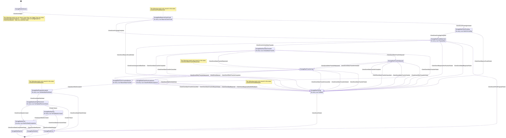
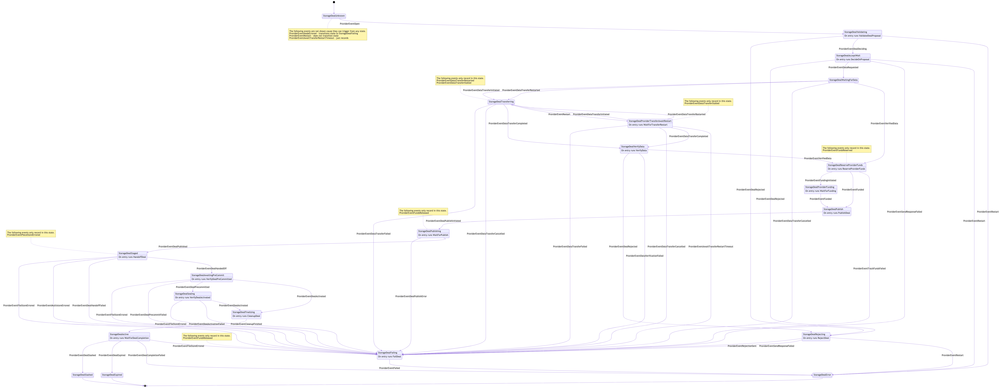

# storagemarket
The storagemarket module is intended for Filecoin node implementations written in Go.
It implements functionality to allow execution of storage market deals, and for Providers to set their storage price on the Filecoin network.
The node implementation must provide access to chain operations, and persistent 
data storage.

## Table of Contents
* [Background reading](#background-reading)
* [Installation](#Installation)
* [Operation](#Operation)
* [Implementation](#Implementation)
    * [StorageCommon](#StorageCommon)
    * [StorageClientNode](#StorageClientNode)
    * [StorageProviderNode](#StorageProviderNode)
* [Technical Documentation](#technical-documentation)

## Background reading

Please see the 
[Filecoin Storage Market Specification](https://filecoin-project.github.io/specs/#systems__filecoin_markets__storage_market).

## Installation
The build process for storagemarket requires Go >= v1.13.

To install:
```bash
go get github.com/filecoin-project/go-fil-markets/storagemarket
```

## Operation
The `storagemarket` package provides high level APIs to execute data storage deals between a
storage client and a storage provider (a.k.a. storage miner) on the Filecoin network.
The Filecoin node must implement the [`StorageCommon`](#StorageCommon), [`StorageProviderNode`](#StorageProviderNode), and
[`StorageClientNode`](#StorageClientNode) interfaces in order to construct and use the module.

Deals are expected to survive a node restart; deals and related information are
 expected to be stored on disk.
 
`storagemarket` communicates its deal operations and requested data via 
                [go-data-transfer](https://github.com/filecoin-project/go-data-transfer) using 
                [go-graphsync](https://github.com/ipfs/go-graphsync).

## Implementation

### General Steps
1. Decide if your node can be configured as a Storage Provider, a Storage Client or both.
1. Determine how and where your retrieval calls to StorageProvider and StorageClient functions
 will be made.
1. Implement the required interfaces as described in this section.
1. Construct a [StorageClient](#StorageClient) and/or [StorageProvider](#StorageProvider) in your node's startup.
Call the StorageProvider's `Start` function it in the appropriate place, and its `Stop` 
function in the appropriate place.
1. Expose desired `storagemarket` functionality to whatever internal modules desired, such as
 command line interface, JSON RPC, or HTTP API.

Implement the [`StorageCommon`](#StorageCommon), [`StorageProviderNode`](#StorageProviderNode), and
              [`StorageClientNode`](#StorageClientNode) interfaces in 
              [storagemarket/types.go](./types.go), described below:

### StorageCommon
`StorageCommon` is an interface common to both `StorageProviderNode` and `StorageClientNode`. Its
 functions are:
* [`GetChainHead`](#GetChainHead)
* [`AddFunds`](#AddFunds)
* [`ReserveFunds`](#ReserveFunds)
* [`ReleaseFunds`](#ReleaseFunds)
* [`GetBalance`](#GetBalance)
* [`VerifySignature`](#VerifySignature)
* [`WaitForMessage`](#WaitForMessage)
* [`SignBytes`](#SignBytes)
* [`GetMinerWorkerAddress`](#GetMinerWorkerAddress)

#### AddFunds
```go
func AddFunds(ctx context.Context, addr address.Address, amount abi.TokenAmount) (cid.Cid, error)
```

Send `amount` to `addr` by posting a message on chain. Return the message CID.

#### ReserveFunds
```go
func ReserveFunds(ctx context.Context, addr, wallet address.Address, amount abi.TokenAmount) (cid.Cid, error)
```
 
Add `amount` to the total reserved funds for `addr`. If total available balance for `addr` in StorageMarketActor is not greater than total reserved, `wallet` should send any needed balance to `addr` by posting a message on chain. Returns the message CID.

#### ReserveFunds
```go
func ReleaseFunds(ctx context.Context, addr address.Address, amount abi.TokenAmount) (cid.Cid, error)
```
 
Release `amount` funds from reserved total for `addr`. No withdrawal is performed for `addr` in the storage market actor but the funds released become
available for future withdrawal
(if new total reserved < total available in SMA) 

#### GetBalance
```go
func GetBalance(ctx context.Context, addr address.Address, tok shared.TipSetToken) (Balance, error)
```
Retrieve the Balance of FIL in `addr`.  A `Balance` consists of `Locked` and `Available` `abi.TokenAmount`s

#### VerifySignature
```go
func VerifySignature(ctx context.Context, signature crypto.Signature, signer address.Address, 
                plaintext []byte, tok shared.TipSetToken) (bool, error)
```
Verify that `signature` is valid, cryptographically and otherwise, for the 
given `signer`, `plaintext`, and `tok`.

#### WaitForMessage
```go
func WaitForMessage(ctx context.Context, mcid cid.Cid, 
               onCompletion func(exitcode.ExitCode, []byte, error) error) error
```
Wait for message CID `mcid` to appear on chain, and call `onCompletion` when it does so.

#### SignBytes
```go
func SignBytes(ctx context.Context, signer address.Address, b []byte) (*crypto.Signature, error)
```

Cryptographically sign bytes `b` using the private key referenced by address `signer`.

#### GetMinerWorkerAddress
```go
func GetMinerWorkerAddress(ctx context.Context, addr address.Address, tok shared.TipSetToken,
                     ) (address.Address, error)
```

Get the miner worker address for the given miner owner, as of `tok`.

---
### StorageProviderNode
`StorageProviderNode` is the interface for dependencies for a `StorageProvider`. It contains:

* [`StorageCommon`](#StorageCommon) interface
* [`PublishDeals`](#PublishDeals)
* [`ListProviderDeals`](#ListProviderDeals)
* [`OnDealSectorCommitted`](#OnDealSectorCommitted)
* [`LocatePieceForDealWithinSector`](#LocatePieceForDealWithinSector)
* [`OnDealExpiredOrSlashed`](#OnDealExpiredOrSlashed)

#### GetChainHead
```go
func GetChainHead(ctx context.Context) (shared.TipSetToken, abi.ChainEpoch, error)
```
Get the current chain head. Return its TipSetToken and its abi.ChainEpoch.

#### PublishDeals
```go
func PublishDeals(ctx context.Context, deal MinerDeal) (cid.Cid, error)
```
Post the deal to chain, returning the posted message CID.

#### OnDealComplete
```go
func OnDealComplete(ctx context.Context, deal MinerDeal, pieceSize abi.UnpaddedPieceSize, 
               pieceReader io.Reader) error
```
The function to be called when MinerDeal `deal` has reached the `storagemarket.StorageDealCompleted` state. 
A `MinerDeal` contains more information than a StorageDeal, including paths, addresses, and CIDs
pertinent to the deal. See [storagemarket/types.go](./types.go)

#### OnDealSectorCommitted
```go
func OnDealSectorCommitted(ctx context.Context, provider address.Address, dealID abi.DealID, 
                      cb DealSectorCommittedCallback) error
```

Register the function to be called once `provider` has committed sector(s) for `dealID`.

#### LocatePieceForDealWithinSector
```go
func LocatePieceForDealWithinSector(ctx context.Context, dealID abi.DealID, tok shared.TipSetToken,
                              ) (sectorID uint64, offset uint64, length uint64, err error)
```

Find the piece associated with `dealID` as of `tok` and return the sector id, plus the offset and
 length of the data within the sector.
 
#### OnDealExpiredOrSlashed
```go
func OnDealExpiredOrSlashed(
    ctx context.Context,
    dealID abi.DealID,
    onDealExpired DealExpiredCallback,
    onDealSlashed DealSlashedCallback) error
```

Register callbacks to be called when a deal expires or is slashed.

---
### StorageClientNode
`StorageClientNode` implements dependencies for a StorageClient. It contains:
* [`StorageCommon`](#StorageCommon) interface
* [`GetChainHead`](#GetChainHead)
* [`ListClientDeals`](#ListClientDeals)
* [`ListStorageProviders`](#ListStorageProviders)
* [`ValidatePublishedDeal`](#ValidatePublishedDeal)
* [`SignProposal`](#SignProposal)
* [`GetDefaultWalletAddress`](#GetDefaultWalletAddress)
* [`OnDealSectorCommitted`](#OnDealSectorCommitted)
* [`OnDealExpiredOrSlashed`](#OnDealExpiredOrSlashed)

#### StorageCommon
`StorageClientNode` implements `StorageCommon`, described above.

#### GetChainHead
```go
func GetChainHead(ctx context.Context) (shared.TipSetToken, abi.ChainEpoch, error)
```
Get the current chain head. Return its TipSetToken and its abi.ChainEpoch.

#### ListStorageProviders
```go
func ListStorageProviders(ctx context.Context, tok shared.TipSetToken
                         ) ([]*StorageProviderInfo, error)
```

Return a slice of `StorageProviderInfo`, for all known storage providers.

#### ValidatePublishedDeal
```go
func ValidatePublishedDeal(ctx context.Context, deal ClientDeal) (abi.DealID, error)
```
Query the chain for `deal` and inspect the message parameters to make sure they match the expected  deal. Return the deal ID.

#### SignProposal
```go
func SignProposal(ctx context.Context, signer address.Address, proposal market.DealProposal
                 ) (*market.ClientDealProposal, error)
```

Cryptographically sign `proposal` using the private key of `signer` and return a
 ClientDealProposal (includes signature data).

#### GetDefaultWalletAddress
```go
func GetDefaultWalletAddress(ctx context.Context) (address.Address, error)
```

Get the Client's default wallet address, which will be used to add Storage Market funds (collateral and payment).

#### OnDealSectorCommitted
```go
func OnDealSectorCommitted(ctx context.Context, provider address.Address, dealID abi.DealID, 
                          cb DealSectorCommittedCallback) error
```

Register a callback to be called once the Deal's sector(s) are committed.

#### OnDealExpiredOrSlashed
```go
func OnDealExpiredOrSlashed(
    ctx context.Context,
    dealID abi.DealID,
    onDealExpired DealExpiredCallback,
    onDealSlashed DealSlashedCallback) error
```

Register callbacks to be called when a deal expires or is slashed.

#### GetMinerInfo
```go
func GetMinerInfo(ctx context.Context, maddr address.Address, tok shared.TipSetToken,
                         ) (*StorageProviderInfo, error)
```

Returns `StorageProviderInfo` for a specific provider at the given address


## Construction

### StorageClient
To construct a new StorageClient: 
```go
func NewClient(
	net network.StorageMarketNetwork,
	bs blockstore.Blockstore,
	dataTransfer datatransfer.Manager,
	discovery *discovery.Local,
	ds datastore.Batching,
	scn storagemarket.StorageClientNode,
) (*Client, error)
```
**Parameters**

* `net network.StorageMarketNetwork` is a network abstraction for the storage market. To create it, use:
    ```go
    package network
    func NewFromLibp2pHost(h host.Host) StorageMarketNetwork
    ```
* `bs blockstore.Blockstore` is an IPFS blockstore for storing and retrieving data for deals.
     See [github.com/ipfs/go-ipfs-blockstore](github.com/ipfs/go-ipfs-blockstore).
* `dataTransfer datatransfer.Manager` is an interface from [github.com/filecoin-project/go-data-transfer](https://github.com/filecoin-project/go-data-transfer)
   There is more than one implementation, but one way to create a new datatransfer.Manager is:
    ```go
    package graphsyncimpl
  
    func NewGraphSyncDataTransfer(host host.Host, gs graphsync.GraphExchange, storedCounter *storedcounter.StoredCounter) datatransfer.Manager
    ```
   Also:
   ```go
    package datatransfer
  
    // NewDAGServiceDataTransfer returns a data transfer manager based on
    // an IPLD DAGService
    func NewDAGServiceDataTransfer(dag ipldformat.DAGService) datatransfer.Manager
    ```
    
    Please see the [go-data-transfer repo](https://github.com/filecoin-project/go-data-transfer) for more information.
    
* `discovery *discovery.Local` implements the `PeerResolver` interface. To initialize a new discovery.Local:
    ```go
    func NewLocal(ds datastore.Batching) *Local
    ```
* `ds datastore.Batching` is a datastore for the deal's state machine. It is
 typically the node's own datastore that implements the IPFS datastore.Batching interface.
 See
  [github.com/ipfs/go-datastore](https://github.com/ipfs/go-datastore).

* `scn storagemarket.StorageClientNode` is the implementation of the [`StorageClientNode`](#StorageClientNode) API 
that was written for your node.

### StorageProvider
To construct a new StorageProvider:
```go
func NewProvider(net network.StorageMarketNetwork, 
                ds datastore.Batching, 
                bs blockstore.Blockstore, 
                fs filestore.FileStore, 
                pieceStore piecestore.PieceStore, 
                dataTransfer datatransfer.Manager, 
                spn storagemarket.StorageProviderNode, 
                minerAddress address.Address, 
                rt abi.RegisteredProof, 
                storedAsk StoredAsk, 
                options ...StorageProviderOption,
) (storagemarket.StorageProvider, error) {
```

**Parameters**
* `net network.StorageMarketNetwork` is the same interface as for [StorageClientNode](#StorageClientNode)
* `ds datastore.Batching` is the same interface as for [StorageClientNode](#StorageClientNode)
* `bs blockstore.Blockstore` is the same interface as for [StorageClientNode](#StorageClientNode)
* `fs filestore.FileStore` is an instance of the [filestore.FileStore](../filestore) struct from the 
    go-fil-markets repo.
* `pieceStore piecestore.PieceStore` is the database of deals and pieces associated with them.
See this repo's [piecestore module](../piecestore).
* `dataTransfer` is the same interface as for [StorageClientNode](#StorageClientNode)
* `spn storagemarket.StorageProviderNode` is the implementation of the [`StorageProviderNode`](#StorageProviderNode) API 
  that was written for your node.
* `minerAddress address.Address` is the miner owner address.
* `rt abi.RegisteredProof` is an int64 indicating the type of proof to use when generating a piece commitment (CommP).
    see [github.com/filecoin-project/go-state-types/abi/sector.go](https://github.com/filecoin-project/specs-actors/blob/master/actors/abi/sector.go)
    for the list and meaning of accepted values.
* `storedAsk StoredAsk` is an interface for getting and adding storage Asks. It is implemented in storagemarket.
    To create a `StoredAsk`:
    ```go
    package storedask
    func NewStoredAsk(ds datastore.Batching, dsKey datastore.Key, spn storagemarket.StorageProviderNode, 
                      actor address.Address) (*StoredAsk, error)
    ```
* `options ...StorageProviderOption` options is a variable length parameter to provide functions that change the
    StorageProvider default configuration. See [provider.go](./impl/provider.go) for the available options.

## Technical Documentation

* [GoDoc](https://godoc.org/github.com/filecoin-project/go-fil-markets/storagemarket) contains an architectural overview and robust API documentation

* Storage Client FSM diagram:

[](https://raw.githubusercontent.com/filecoin-project/go-fil-markets/master/docs/storageclient.mmd.svg)


* Storage Provider FSM diagram:

[](https://raw.githubusercontent.com/filecoin-project/go-fil-markets/master/docs/storageprovider.mmd.svg)
